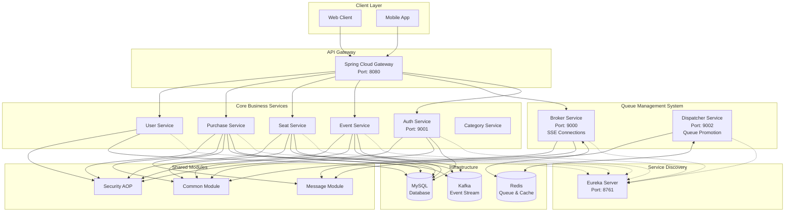
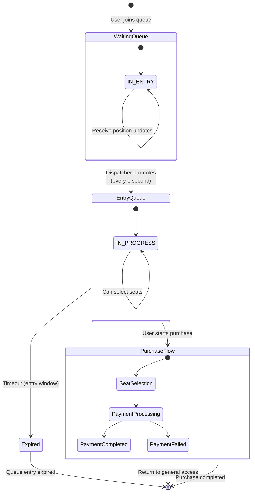

# Ticketon - Event Ticketing System

A microservices-based ticket booking system built with Domain-Driven Design (DDD) principles, featuring high-traffic queue management and real-time seat selection.

## 🏗️ System Architecture

### Overall Architecture Diagram



## 🎯 Waiting Queue System Flow

### High-Traffic Queue Management

```sequence
User->Gateway: GET /events/{id}/tickets/waiting
Gateway->Broker: Forward request (with auth)

note over Broker: Queue Entry Logic
Broker->Redis: Check duplicate entry
Broker->Redis: Get current queue size  
Broker->Redis: ZADD WAITING:{eventId} {timestamp} {userId}
Broker->Redis: HSET WAITING_QUEUE_RECORD:{eventId}
Broker->User: SSE Connection established

loop Every 1 second
    Broker->User: Send queue position via SSE
end

note over Dispatcher: Promotion Processing (Every 1 second)
Dispatcher->Redis: SCAN WAITING:* keys

par Multi-threaded Processing
    Dispatcher->Redis: Execute Lua script (Atomic promotion)
    note over Redis: promote_all_waiting_for_event.lua
    Redis-->Dispatcher: Users promoted to ENTRY queue
end

Dispatcher->Redis: XADD ENTRY stream (promoted users)
Dispatcher->Redis: XADD DISPATCH stream (notification)

Redis->Broker: Stream message (user promoted)  
Broker->User: SSE: "You can now purchase tickets!"

User->Gateway: Access purchase flow
Gateway->Purchase: Process ticket purchase
Purchase->Redis: Lock seats temporarily
Purchase->Purchase: Complete payment
Purchase->Redis: Release queue locks
```

### Queue States and Transitions



## 🛠️ Technology Stack

### Core Technologies
- **Framework**: Spring Boot 3.5, Spring Cloud Gateway
- **Language**: Java 21
- **Database**: MySQL with JPA/Hibernate
- **Cache/Queue**: Redis (Lettuce client)
- **Message Broker**: Apache Kafka
- **Service Discovery**: Eureka
- **Build Tool**: Gradle (Multi-module)

### External Integrations
- **Payment**: Toss Payments API
- **Authentication**: JWT + OAuth2 (Google/Kakao)
- **Monitoring**: Micrometer + Prometheus
- **Containerization**: Docker + Docker Compose

## 📁 Module Structure

### Core Business Services
- **`auth`** - Authentication & authorization with social login
- **`user`** - User profile and account management
- **`event`** - Event creation, management, and querying
- **`seat`** - Seat layout and availability management
- **`purchase`** - Payment processing and ticket purchasing
- **`category-id`** - Event category management

### Queue Management Services
- **`broker`** - SSE connections and real-time queue notifications
- **`dispatcher`** - Multi-threaded queue promotion engine

### Infrastructure Services
- **`gateway`** - API Gateway with routing and load balancing
- **`eureka`** - Service discovery and registration
- **`app`** - Main application orchestrator

### Shared Libraries
- **`common`** - Shared utilities, exceptions, Redis services
- **`message`** - Event messages for inter-service communication
- **`security-aop`** - AOP-based security and user context

## 🚀 Quick Start

### Prerequisites
- Java 21
- Docker & Docker Compose
- MySQL 8.0+
- Redis 6.0+

### Infrastructure Setup
```bash
# Start infrastructure services
docker-compose -f docker/docker-compose.yml up -d

# Verify services are running
docker-compose -f docker/docker-compose.yml ps
```

### Build and Run Services
```bash
# Build all modules
./gradlew build

# Start service discovery
./gradlew :eureka:bootRun

# Start API Gateway
./gradlew :gateway:bootRun

# Start core services
./gradlew :auth:bootRun
./gradlew :broker:bootRun
./gradlew :dispatcher:bootRun
./gradlew :purchase:bootRun
./gradlew :event:bootRun
./gradlew :seat:bootRun
./gradlew :user:bootRun
```

### Service Endpoints
- **Gateway**: http://localhost:8080
- **Eureka Dashboard**: http://localhost:8761
- **Broker (SSE)**: http://localhost:9000
- **Dispatcher**: http://localhost:9002
- **Auth Service**: http://localhost:9001

## 📊 Key Features

### High-Performance Queue System
- **Real-time Updates**: SSE-based queue position notifications
- **Horizontal Scaling**: Redis-based distributed state management
- **Atomic Operations**: Lua scripts for consistent queue promotions
- **Backpressure Handling**: Thread pool management with overflow policies

### Domain-Driven Design
- **Aggregate Boundaries**: Clear separation of business domains
- **Domain Services**: Encapsulated business logic
- **Event-Driven Communication**: Kafka-based inter-service messaging
- **Repository Pattern**: Clean data access abstraction

### Security & Authentication
- **JWT Tokens**: Stateless authentication
- **OAuth2 Integration**: Google and Kakao social login
- **Role-Based Access**: Fine-grained permission control
- **AOP Security**: Cross-cutting security concerns

### Monitoring & Observability
- **Health Checks**: Spring Actuator endpoints
- **Metrics**: Prometheus-compatible metrics export
- **Distributed Tracing**: Request correlation across services
- **Logging**: Structured logging with correlation IDs

## 🏗️ Development Guidelines

### Code Organization
- Follow DDD principles with clear aggregate boundaries
- Use domain services for complex business logic
- Implement repository pattern for data access
- Apply AOP for cross-cutting concerns

### Testing Strategy
```bash
# Run all tests
./gradlew test

# Run specific module tests
./gradlew :purchase:test
./gradlew :broker:test
```

### Database Migration
- Use JPA/Hibernate auto-DDL for development
- Manual schema management for production
- Event sourcing for audit trails

## 🚦 API Documentation

### Authentication Endpoints
- `POST /auth/login` - User login
- `POST /auth/oauth/google` - Google OAuth login
- `POST /auth/oauth/kakao` - Kakao OAuth login
- `POST /auth/refresh` - Token refresh

### Event & Ticketing Endpoints  
- `GET /events` - List events
- `GET /events/{id}` - Event details
- `GET /events/{id}/seats` - Seat layout
- `GET /events/{id}/tickets/waiting` - Join waiting queue (SSE)
- `POST /purchase/initiate` - Initiate payment
- `POST /purchase/confirm` - Confirm payment

### Queue Management (Internal)
- Broker handles SSE connections
- Dispatcher processes queue promotions
- Redis streams coordinate between services

## 📈 Performance Characteristics

### Throughput
- **Queue Processing**: 1000+ promotions per second
- **Concurrent SSE**: 10,000+ simultaneous connections  
- **Database**: Optimized for high read/write ratios
- **Redis Operations**: Sub-millisecond response times

### Scalability
- **Horizontal**: Add broker/dispatcher instances
- **Vertical**: Thread pool and connection tuning
- **Database**: Read replicas and connection pooling
- **Caching**: Multi-level caching strategy

## 🔒 Security Considerations

### Authentication & Authorization
- JWT token validation on all protected endpoints
- Role-based access control (USER, ADMIN, MANAGER)
- OAuth2 integration with external providers
- Session management with Redis

### Data Protection
- Sensitive data encryption at rest
- TLS/SSL for all external communications
- PII data handling compliance
- Audit logging for all financial transactions

## 🔄 최근 변경사항

### v1.3.0 - 인스턴스별 전용 DISPATCH 스트림 구조 구현
- **인스턴스별 스트림 분리**: 각 디스패처 인스턴스가 전용 DISPATCH 스트림을 가지도록 개선
- **성능 향상**: 스트림 분산을 통한 처리량 증가 및 부하 분산
- **확장성 개선**: 수평 확장 시 스트림 격리로 안정성 향상
- **동시성 최적화**: 인스턴스 간 메시지 처리 충돌 방지

### v1.2.0 - 프런트엔드 연동 및 이벤트 조회 기능
- **프런트엔드 통합**: React 기반 클라이언트와 API 연동 완료
- **이벤트 조회 API**: 필터링 및 페이지네이션 지원
- **실시간 대기열**: SSE를 통한 실시간 위치 업데이트
- **UI/UX 개선**: 대기열 상태 시각화 및 사용자 경험 향상

## 🛠️ 빌드 및 실행 방법

### 1. 사전 요구사항
```bash
# Java 21 설치 확인
java --version

# Docker 및 Docker Compose 설치 확인
docker --version
docker-compose --version
```

### 2. 인프라 서비스 시작
```bash
# MySQL, Redis, Kafka 등 인프라 서비스 실행
docker-compose -f docker/docker-compose.yml up -d

# 서비스 상태 확인
docker-compose -f docker/docker-compose.yml ps
```

### 3. 애플리케이션 빌드
```bash
# 전체 모듈 빌드
./gradlew clean build

# 특정 모듈만 빌드
./gradlew :auth:build
./gradlew :broker:build
```

### 4. 서비스 실행 순서
```bash
# 1. 서비스 디스커버리 시작
./gradlew :eureka:bootRun

# 2. API 게이트웨이 시작 (새 터미널)
./gradlew :gateway:bootRun

# 3. 핵심 서비스들 시작 (각각 새 터미널에서)
./gradlew :auth:bootRun          # 인증 서비스
./gradlew :broker:bootRun        # 대기열 관리 (SSE)
./gradlew :dispatcher:bootRun    # 대기열 처리 엔진
./gradlew :event:bootRun         # 이벤트 관리
./gradlew :seat:bootRun          # 좌석 관리
./gradlew :purchase:bootRun      # 결제 처리
./gradlew :user:bootRun          # 사용자 관리
```

### 5. 서비스 접근 포트
- **메인 API**: http://localhost:8080 (Gateway)
- **유레카 대시보드**: http://localhost:8761
- **브로커 서비스**: http://localhost:9000
- **디스패처 서비스**: http://localhost:9002
- **인증 서비스**: http://localhost:9001

### 6. Docker를 이용한 실행 (선택사항)
```bash
# Docker 이미지 빌드
./gradlew bootBuildImage

# 전체 스택 실행
docker-compose up -d
```

### 7. 개발 환경 설정
```bash
# 테스트 실행
./gradlew test

# 특정 모듈 테스트
./gradlew :purchase:test

# 라이브 리로드 모드 (개발용)
./gradlew :gateway:bootRun --continuous
```

### 8. 환경별 설정
- **개발환경**: `application-dev.yml`
- **운영환경**: `application-prod.yml`
- **테스트환경**: `application-test.yml`

```bash
# 특정 프로파일로 실행
./gradlew :auth:bootRun -Dspring.profiles.active=dev
```

## 📝 Contributing

1. Follow the existing code style and conventions
2. Write comprehensive tests for new features
3. Update documentation for API changes
4. Use conventional commits for clear history
5. Submit PRs with detailed descriptions

## 📋 License

This project is licensed under the MIT License - see the LICENSE file for details.