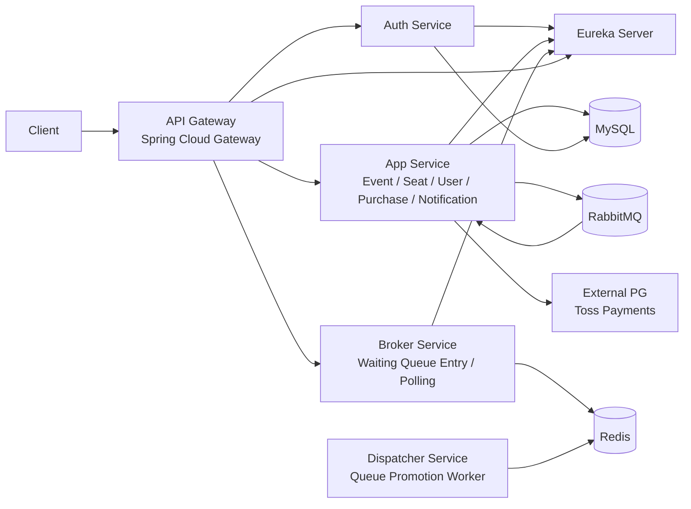

# ticketon-DDD

`ticketon-DDD`는 기존 티켓 예매 프로젝트를 도메인 중심으로 재구성하고, 대기열·결제·인증·이벤트·좌석 도메인을 멀티모듈 구조로 분리한 티켓 예매 시스템입니다.

티켓 오픈 시점처럼 트래픽이 짧은 시간에 집중되는 상황을 가정하고, 대기열 제어, 비동기 결제 승인, 이벤트 정보 변경 검증, 인증/인가 분리, 관측성 확보를 중심으로 개선했습니다.

---

## 1. 프로젝트 설명

이 프로젝트는 티켓 예매 과정에서 발생하는 트래픽 집중, 결제 정합성, 외부 API 지연, 도메인 간 결합도 증가 문제를 해결하기 위해 작성되었습니다.

핵심 방향은 다음과 같습니다.

- DDD 기반 멀티모듈 분리
- Redis 기반 polling 대기열 처리
- RabbitMQ + Outbox 기반 비동기 결제 승인
- 이벤트 salesVersion 기반 결제 정합성 검증
- Spring Cloud Gateway + Eureka 기반 라우팅
- Actuator, Prometheus, OpenTelemetry 기반 관측성 구성
- ArchUnit 기반 아키텍처 규칙 검증

---

## 2. 아키텍처

### 2.1 전체 구조


```mermaid
flowchart LR
    Client[Client]

    Gateway[API Gateway<br/>Spring Cloud Gateway]
    Eureka[Eureka Server]

    App[App Service<br/>Event / Seat / User / Purchase / Notification]
    Auth[Auth Service]
    Broker[Broker Service<br/>Waiting Queue Entry / Polling]
    Dispatcher[Dispatcher Service<br/>Queue Promotion Worker]

    Redis[(Redis)]
    MySQL[(MySQL)]
    RabbitMQ[(RabbitMQ)]
    PG[External PG<br/>Toss Payments]

    Client --> Gateway

    Gateway --> Auth
    Gateway --> App
    Gateway --> Broker

    Auth --> Eureka
    App --> Eureka
    Broker --> Eureka
    Gateway --> Eureka

    Broker --> Redis
    Dispatcher --> Redis

    App --> MySQL
    Auth --> MySQL

    App --> RabbitMQ
    RabbitMQ --> App

    App --> PG
```

### 2.2 모듈 구조

```text
ticketon-DDD
├── app                  # 통합 애플리케이션 실행 모듈
├── auth                 # 인증/인가 서비스
├── broker               # 대기열 진입 및 polling 상태 조회
├── dispatcher           # 대기열 승격 처리 워커
├── event                # 이벤트 도메인
├── seat                 # 좌석 도메인
├── user                 # 사용자 도메인
├── purchase             # 구매/결제 도메인
├── notification         # 알림 도메인
├── redislock            # Redis 기반 분산 락
├── security-aop         # 인증/인가 AOP
├── platform
│   ├── common           # 공통 타입, 응답, 예외, 유틸
│   ├── message          # 메시지 계약
│   ├── gateway          # Spring Cloud Gateway
│   └── eureka           # Eureka Server
└── nplus1-test          # N+1 테스트/검증용 모듈
```

### 2.3 계층 구조

```text
ui → app → domain
app → domain port
infra → domain port 구현
domain → 외부 기술 의존 금지
```

도메인 계층이 Spring Web, Redis, AMQP, JPA Repository 구현체, UI 계층에 직접 의존하지 않도록 ArchUnit 테스트로 검증합니다.

---

## 3. 사용 도구

| 구분 | 기술 |
| --- | --- |
| Language | Java 21 |
| Framework | Spring Boot 3.5.0 |
| Build | Gradle |
| Persistence | Spring Data JPA, Hibernate, QueryDSL |
| Database | MySQL |
| Cache / Queue State | Redis, Lettuce, Redisson |
| Messaging | RabbitMQ, Spring AMQP |
| Batch / Scheduling | Spring Batch, Spring Scheduling |
| Security | Spring Security, JWT, Spring AOP |
| Gateway | Spring Cloud Gateway WebFlux |
| Service Discovery | Netflix Eureka |
| API Docs | SpringDoc OpenAPI / Swagger UI |
| Observability | Spring Actuator, Micrometer, Prometheus, OpenTelemetry |
| Test | JUnit 5, Spring Boot Test, Testcontainers, RestAssured, Awaitility |
| Architecture Test | ArchUnit |

---

## 4. 주요 구현 사항

### 4.1 Polling 기반 대기열 처리

- 비즈니스 문제: 티켓 오픈 시점에 사용자가 구매 API로 한 번에 몰리면 서버와 DB가 급격히 포화될 수 있었습니다.
- 기술적 해결: Redis ZSet, Hash, Stream과 Dispatcher를 이용해 대기열 진입·순번 조회·입장 승격을 polling 방식으로 처리했습니다.
- 성과: 구매 요청을 입장 가능한 사용자로 제한하고, 장시간 연결 유지 없이 서버 자원 점유를 짧은 요청 단위로 분산했습니다.

### 4.2 비동기 결제 승인 처리

- 비즈니스 문제: 외부 PG API 지연이 요청 스레드와 트랜잭션을 오래 점유해 결제 요청 처리량이 떨어지는 문제가 있었습니다.
- 기술적 해결: 결제 승인 요청은 Outbox에 저장한 뒤 RabbitMQ Worker가 비동기로 PG 승인과 티켓 발급을 처리하도록 분리했습니다.
- 성과: 사용자는 결제 승인 요청 접수 응답을 빠르게 받고, 서버는 외부 API 지연과 핵심 요청 처리 자원을 분리할 수 있었습니다.

### 4.3 결제 중 이벤트 정보 변경 검증

- 비즈니스 문제: 결제 준비 이후 이벤트 가격이나 판매 정보가 변경되면 사용자가 본 조건과 실제 승인 조건이 달라질 수 있었습니다.
- 기술적 해결: 결제 준비 시 `expectedSalesVersion`을 저장하고, PG 승인 직전에 현재 `salesVersion`과 비교했습니다.
- 성과: 변경된 이벤트 조건으로 결제가 진행되는 문제를 PG 승인 전에 차단할 수 있었습니다.

### 4.4 Outbox 기반 메시지 발행 안정화

- 비즈니스 문제: DB 저장과 메시지 발행이 분리되어 있으면 서버 장애 시 결제 승인 작업이 유실되거나 중복 처리될 수 있었습니다.
- 기술적 해결: 결제 상태와 Outbox 메시지를 같은 트랜잭션에 저장하고, 커밋 이후 발행 및 Scheduler 재처리를 적용했습니다.
- 성과: 메시지 발행 실패 상황에서도 미처리 결제 승인 작업을 다시 처리할 수 있게 했습니다.

### 4.5 중복 결제 승인 방지

- 비즈니스 문제: RabbitMQ 메시지가 중복 전달되거나 Worker가 재시도되면 PG 중복 승인과 중복 티켓 발급이 발생할 수 있었습니다.
- 기술적 해결: `purchase_processed_message`와 PG idempotency key를 이용해 메시지 처리와 PG 호출을 멱등하게 구성했습니다.
- 성과: 재시도 상황에서도 동일 결제 요청이 중복 승인되는 위험을 줄였습니다.

### 4.6 인증/인가 로직 분리

- 비즈니스 문제: 각 API마다 인증과 권한 검증 로직이 반복되면 보안 정책 변경이 어렵고 누락 위험이 커지는 문제가 있었습니다.
- 기술적 해결: Auth 모듈, Gateway 인증 필터, Security AOP를 분리해 인증/인가 흐름을 공통화했습니다.
- 성과: 컨트롤러의 중복 보안 코드를 줄이고, 권한 검증 정책을 일관되게 적용할 수 있었습니다.

### 4.7 DDD 멀티모듈 구조 전환

- 비즈니스 문제: 도메인 코드가 한 프로젝트에 섞이면 모듈 간 의존성이 커지고 변경 영향 범위를 파악하기 어려운 문제가 있었습니다.
- 기술적 해결: event, seat, purchase, user, auth, broker, dispatcher 등을 도메인/역할 단위 모듈로 분리했습니다.
- 성과: 각 도메인의 책임이 명확해지고, 기능 변경 시 영향 범위를 모듈 단위로 좁힐 수 있었습니다.

### 4.8 아키텍처 규칙 자동 검증

- 비즈니스 문제: 도메인 계층이 Spring, Redis, JPA 구현체 등에 직접 의존하면 DDD 계층 구조가 쉽게 무너지는 문제가 있었습니다.
- 기술적 해결: ArchUnit으로 domain, app, infra, ui 계층 간 의존성 규칙을 테스트로 검증했습니다.
- 성과: 코드 변경 이후에도 도메인 계층의 기술 의존과 모듈 간 직접 참조를 지속적으로 감지할 수 있게 했습니다.

### 4.9 관측성 구성

- 비즈니스 문제: 부하 상황에서 병목이 API, Redis, RabbitMQ, DB, 스레드 중 어디서 발생하는지 파악하기 어려운 문제가 있었습니다.
- 기술적 해결: Actuator, Micrometer, Prometheus, OpenTelemetry를 적용해 서비스별 지표와 추적 정보를 수집할 수 있도록 구성했습니다.
- 성과: 대기열 승격, 결제 처리, HTTP 요청, JVM 상태를 운영 관점에서 확인할 수 있는 기반을 마련했습니다.

---

## 5. 실행 및 테스트

### 전체 빌드

```bash
./gradlew clean build
```

### 주요 모듈 실행

```bash
./gradlew :app:bootRun
./gradlew :auth:bootRun
./gradlew :broker:bootRun
./gradlew :dispatcher:bootRun
./gradlew :platform:gateway:bootRun
./gradlew :platform:eureka:bootRun
```

### 테스트

```bash
./gradlew test
./gradlew :purchase:test
./gradlew architectureRules
```
