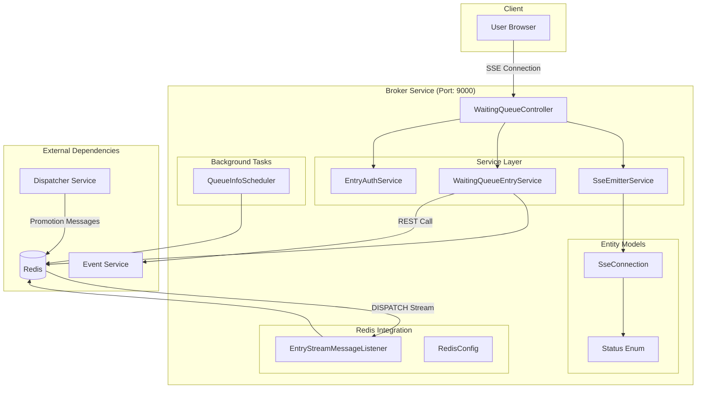

# Broker Service

The Broker service manages real-time Server-Sent Events (SSE) connections for the waiting queue system, providing users with live updates on their queue position and promotion status.

## 🎯 Purpose

- **Real-time Communication**: SSE-based live queue updates
- **Queue State Management**: User queue entry and status tracking  
- **Connection Management**: Efficient SSE connection lifecycle handling
- **Authentication Integration**: JWT token generation for queue access

## 🏗️ Architecture

### Service Architecture Diagram



### Data Flow

```sequence
User->Controller: GET /events/{id}/tickets/waiting
Controller->QueueService: enterWaitingQueue(eventId, userId)

note over QueueService: Queue Entry Logic
QueueService->Redis: Check duplicate entry
QueueService->Redis: Get seat count from Event Service
QueueService->Redis: ZADD WAITING:{eventId}
QueueService->Redis: HSET queue metadata

Controller->SseService: createSseConnection(userId, eventId)
SseService->User: SSE Connection established

loop Every 1 second
    Scheduler->Redis: Get queue positions
    Scheduler->SseService: Broadcast positions
    SseService->User: Queue position update
end

loop Every 5 seconds
    Scheduler->SseService: Send heartbeat
    SseService->User: Keep-alive message
end

note over Redis: User promoted by Dispatcher
Redis->StreamListener: DISPATCH stream message
StreamListener->SseService: User promoted notification
SseService->User: "You can now purchase tickets!"
```

## 📡 API Endpoints

### Queue Management

#### Join Waiting Queue
```http
GET /api/v1/broker/events/{eventId}/tickets/waiting
```

**Headers:**
- `Authorization: Bearer {JWT_TOKEN}`

**Response:**
- **Content-Type**: `text/event-stream`
- **Connection**: Server-Sent Events stream

**SSE Event Types:**
```javascript
// Queue position update
data: {"type": "QUEUE_POSITION", "position": 42, "totalWaiting": 150}

// Promotion notification  
data: {"type": "PROMOTED", "entryToken": "jwt_token_here", "message": "You can now purchase tickets!"}

// Error notification
data: {"type": "ERROR", "message": "Event not found"}

// Heartbeat (every 5 seconds)
data: {"type": "HEARTBEAT", "timestamp": "2025-01-22T10:30:00Z"}
```

**Authentication Required:**
- `@AuthNeeded`: Valid JWT token required
- `@RoleRequired({Role.USER})`: USER role required

## 🗂️ Domain Structure

### Entity Models

#### SseConnection
```java
public class SseConnection {
    private SseEmitter emitter;      // Spring SSE emitter
    private Status status;           // User queue status  
    private String eventId;          // Associated event ID
}
```

#### Status Enum
```java
public enum Status {
    IN_ENTRY,      // User waiting in queue
    IN_PROGRESS    // User promoted, can purchase tickets
}
```

### Service Layer

#### SseEmitterService
**Responsibilities:**
- SSE connection lifecycle management
- Connection pool management (`ConcurrentHashMap`)
- Real-time message broadcasting
- Automatic connection cleanup

**Key Methods:**
```java
SseEmitter createSseConnection(String userId, String eventId)
void sendQueuePosition(String userId, int position, int total)  
void sendPromotionNotification(String userId, String entryToken)
void removeConnection(String userId)
```

#### WaitingQueueEntryService  
**Responsibilities:**
- Queue entry validation and processing
- Redis data structure management
- Duplicate entry prevention
- Integration with Event Service

**Redis Data Structures:**
```redis
# Ordered queue (sorted by timestamp)
WAITING:{eventId} -> ZSet(score=timestamp, member=userId)

# User metadata
WAITING_QUEUE_INDEX_RECORD:{eventId} -> Hash(userId -> {position, timestamp, ...})

# Duplicate prevention  
WAITING_USER_IDS:{eventId} -> Hash(userId -> "true")
```

#### EntryAuthService
**Responsibilities:**
- JWT token generation for queue access
- Token signing and validation
- Entry permission management

**Token Claims:**
```json
{
  "userId": "user123",
  "eventId": "event456", 
  "iat": 1642845600,
  "exp": 1642849200,
  "purpose": "QUEUE_ENTRY"
}
```

### Redis Integration

#### EntryStreamMessageListener
**Stream Processing:**
- **Consumer Group**: `BROKER_GROUP_{instanceId}`  
- **Stream**: `DISPATCH`
- **Batch Size**: 10 messages
- **Poll Timeout**: 2 seconds

**Message Format:**
```json
{
  "userId": "user123",
  "eventId": "event456", 
  "instanceId": "broker-1",
  "promotedAt": "2025-01-22T10:30:00Z"
}
```

### Background Processing

#### QueueInfoScheduler
**Scheduled Tasks:**

**Queue Position Updates** (Every 1 second):
```java
@Scheduled(cron = "* * * * * *")
public void broadcastQueueInfo()
```
- Queries Redis for current queue positions
- Broadcasts position updates to all connected users
- Uses Redis ZRANK for efficient position calculation

**Connection Heartbeat** (Every 5 seconds):
```java  
@Scheduled(cron = "*/5 * * * * *")
public void sendHeartbeat()
```
- Sends keep-alive messages to maintain SSE connections
- Detects and cleans up dead connections
- Updates Redis connection metadata

## ⚙️ Configuration

### Application Properties

```yaml
server:
  port: 9000
  
spring:
  application:
    name: broker
  data:
    redis:
      host: localhost
      port: 6379
      timeout: 2000ms
      
broker:
  jwt:
    secret: ${JWT_SECRET:your-secret-key}
    expiration: 300000  # 5 minutes
  sse:
    timeout: 0          # Infinite timeout
    heartbeat-interval: 5000
  queue:
    position-update-interval: 1000
```

### Redis Configuration

```java
@Configuration
public class RedisConfig {
    // Key naming constants
    public static final String WAITING_QUEUE_KEY_NAME = "WAITING";
    public static final String WAITING_QUEUE_INDEX_RECORD_KEY_NAME = "WAITING_QUEUE_INDEX_RECORD";
    public static final String WAITING_USER_IDS_KEY_NAME = "WAITING_USER_IDS";
    public static final String DISPATCH_QUEUE_CHANNEL_NAME = "DISPATCH";
    
    // Stream configuration
    public static final String CONSUMER_GROUP = "BROKER_GROUP";
    public static final int BATCH_SIZE = 10;
    public static final Duration POLL_TIMEOUT = Duration.ofSeconds(2);
}
```

## 🔧 Development

### Running the Service

```bash
# Development mode
./gradlew :broker:bootRun

# With specific profile
./gradlew :broker:bootRun --args='--spring.profiles.active=dev'

# Build Docker image
./gradlew :broker:bootBuildImage
```

### Testing SSE Connections

#### Using curl:
```bash
# Join waiting queue
curl -H "Authorization: Bearer YOUR_JWT_TOKEN" \
     -H "Accept: text/event-stream" \
     http://localhost:9000/api/v1/broker/events/123/tickets/waiting
```

#### Using JavaScript:
```javascript
const eventSource = new EventSource(
  'http://localhost:9000/api/v1/broker/events/123/tickets/waiting',
  {
    headers: {
      'Authorization': 'Bearer ' + jwtToken
    }
  }
);

eventSource.onmessage = function(event) {
  const data = JSON.parse(event.data);
  console.log('Queue update:', data);
};

eventSource.onerror = function(event) {
  console.error('SSE error:', event);
};
```

### Testing Redis Integration

```bash
# Monitor Redis streams
redis-cli XREAD COUNT 10 STREAMS DISPATCH 0-0

# Check queue status
redis-cli ZRANGE WAITING:event123 0 -1 WITHSCORES
redis-cli HGETALL WAITING_QUEUE_INDEX_RECORD:event123
```

## 📊 Monitoring

### Metrics Exposed

- **SSE Connection Count**: `broker_sse_connections_active`
- **Queue Join Rate**: `broker_queue_joins_total`  
- **Message Send Rate**: `broker_messages_sent_total`
- **Connection Errors**: `broker_connection_errors_total`

### Health Checks

```http
GET /actuator/health
GET /actuator/metrics
GET /actuator/prometheus
```

### Logging

```yaml
logging:
  level:
    org.codenbug.broker: DEBUG
    org.springframework.data.redis: INFO
  pattern:
    console: "%d{HH:mm:ss.SSS} [%thread] %-5level [%X{correlationId}] %logger{36} - %msg%n"
```

## 🚨 Error Handling

### Common Error Scenarios

1. **Duplicate Queue Entry**
   - Check: Redis hash for existing user
   - Action: Return error message via SSE

2. **Event Not Found**
   - Check: Event Service API call
   - Action: Close SSE connection with error

3. **SSE Connection Lost**  
   - Detection: Connection timeout/error callbacks
   - Action: Cleanup Redis state, update metrics

4. **Redis Connection Issues**
   - Fallback: Graceful degradation

## 🧯 Load Considerations (문제와 해결)

**문제(고부하 위험)**  
- `KEYS WAITING:*` 기반 전수 조회는 Redis 전체 키스페이스를 블로킹 스캔하여, 키 수가 많아질수록 지연/타임아웃이 발생합니다.

**해결 방법(현재 적용됨)**  
- `SCAN` 기반 조회로 전환하여 커서 방식의 비블로킹 스캔을 사용합니다.  
- 전체 조회는 유지하면서도 Redis 단일 스레드 점유 시간을 줄여 고부하 상황의 응답 지연을 완화합니다.
   - Recovery: Automatic reconnection with backoff

### Error Response Format

```json
{
  "type": "ERROR",
  "code": "DUPLICATE_ENTRY", 
  "message": "User already in queue for this event",
  "timestamp": "2025-01-22T10:30:00Z"
}
```

## 🔒 Security

### Authentication Flow

1. **JWT Validation**: Verify token signature and expiration
2. **Role Check**: Ensure USER role present
3. **Rate Limiting**: Prevent spam connections (future enhancement)
4. **CORS Configuration**: Restrict allowed origins

### Data Privacy

- **No PII in Logs**: User IDs only, no personal information
- **Token Expiration**: Short-lived entry tokens (5 minutes)  
- **Connection Security**: WSS in production environments
- **Data Encryption**: Redis data encrypted at rest (production)

## 📈 Performance Tuning

### Connection Management
- **Pool Size**: Tune `ConcurrentHashMap` initial capacity
- **Memory Usage**: Monitor SSE connection memory footprint
- **GC Tuning**: Optimize for low-latency real-time updates

### Redis Optimization  
- **Connection Pooling**: Lettuce connection pool tuning
- **Pipeline Operations**: Batch Redis operations where possible
- **Memory Management**: Monitor Redis memory usage patterns

### Thread Configuration
- **Scheduler Threads**: Adjust cron expressions for load
- **Connection Threads**: Tune Tomcat connector threads
- **Async Processing**: Use `@Async` for non-blocking operations

## 🔗 Integration Points

### Upstream Dependencies
- **Gateway**: Routes SSE requests to broker instances
- **Auth Service**: Validates JWT tokens
- **Event Service**: Provides event metadata and seat counts

### Downstream Dependencies  
- **Redis**: Primary state store for queue management
- **Dispatcher**: Receives promotion messages via Redis streams

### Message Contracts
- **DISPATCH Stream**: User promotion notifications
- **SSE Events**: Real-time client updates
- **REST APIs**: Event service integration
