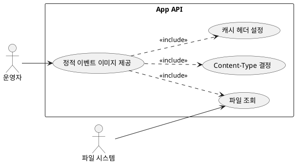

# App Module API 문서

- 대상: `app` 모듈의 모든 엔드포인트
- 기준: 코드 기준 동작/정책/제약사항을 정리

## 목차
- [유저 스토리](#유저-스토리)
- [유스케이스](#유스케이스)
- [정책과 제약사항](#정책과-제약사항)
- [엔드포인트 상세](#엔드포인트-상세)

## 유저 스토리
- 운영자는 이벤트 이미지 파일을 정적 경로로 제공해 웹/앱에서 바로 접근하고 싶다.

## 유스케이스

## 유스케이스 다이어그램

## 유스케이스 기반 이벤트 도출
| 유스케이스 | 이벤트 후보 | 목적 | 사용 여부 | 비고 |
| --- | --- | --- | --- | --- |
| 정적 이벤트 이미지 제공 | 없음 | 단일 모듈 내부 처리 | 해당 없음 | 외부 어그리거트/부가기능 연계 없음 |

- 정적 이벤트 이미지 제공

## 정책과 제약사항
- 정적 이미지는 `static/events/images/{fileName}` 경로에서 제공된다.
- 파일이 없으면 404를 반환한다.
- 확장자에 따라 Content-Type을 결정한다. (`.webp`, `.jpg`, `.jpeg`, `.png`, `.gif`)
- 캐시 헤더는 `Cache-Control: public, max-age=31536000`로 고정된다.
- 인증/권한 검증은 없다.

## 엔드포인트 상세
- GET `/static/events/images/{fileName}`
  - 목적: 이벤트 이미지 파일 제공
  - 인증: 없음
  - 요청: `fileName` 경로 변수
  - 응답: 이미지 바이너리(Resource)
  - 동작 상세:
    - 기본 경로는 프로젝트 루트의 `static/events/images/{fileName}`
    - 기본 경로에 없으면 몇 가지 대체 경로를 순차적으로 확인
    - 존재하면 Content-Type을 확장자로 판단해 응답
