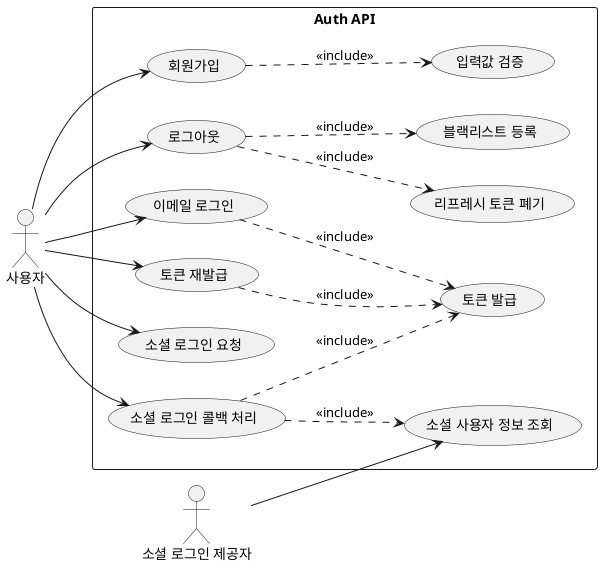

# Auth Module API 문서

- 대상: `auth` 모듈의 모든 엔드포인트
- 기준: 코드 기준 동작/정책/제약사항을 정리

## 목차
- [유저 스토리](#유저-스토리)
- [유스케이스](#유스케이스)
- [정책과 제약사항](#정책과-제약사항)
- [엔드포인트 상세](#엔드포인트-상세)

## 유저 스토리
- 사용자는 이메일/비밀번호로 회원가입하고 로그인하고 싶다.
- 사용자는 소셜 로그인으로 간편하게 로그인하고 싶다.
- 사용자는 토큰 갱신과 로그아웃을 통해 세션을 관리하고 싶다.

## 유스케이스

## 유스케이스 다이어그램

## 유스케이스 기반 이벤트 도출
| 유스케이스 | 이벤트 후보 | 목적 | 사용 여부 | 비고 |
| --- | --- | --- | --- | --- |
| 이메일 회원가입 | SecurityUserRegistered | User 프로필 생성 트리거 | 사용 중 | 인증 어그리거트 밖 처리 필요 |
| 이메일 회원가입 | UserRegistrationFailed | 보상/에러 알림 | 미사용(후보) | 외부 보상 흐름 필요 |
| 이메일 로그인 | AuthLoginSucceeded | 보안 감사/알림 | 미사용(후보) | 부가기능 |
| 이메일 로그인 | AuthLoginFailed | 보안 감사/계정 보호 | 미사용(후보) | 부가기능 |
| 소셜 로그인 콜백 처리 | SnsUserRegistered | User 프로필 생성 트리거 | 사용 중 | 인증 어그리거트 밖 처리 필요 |
| 토큰 재발급 | AuthTokenRefreshed | 보안 감사/세션 추적 | 미사용(후보) | 부가기능 |
| 로그아웃 | AuthLogoutCompleted | 세션 무효화 후속 처리 | 미사용(후보) | 외부/부가기능 연계 |

- 이메일 회원가입
- 이메일 로그인
- 소셜 로그인 요청/콜백 처리
- 토큰 재발급
- 로그아웃

## 정책과 제약사항
- 회원가입 입력값은 검증된다.
  - email: 이메일 형식, 공백 불가
  - password, name, sex, phoneNum, location: 공백 불가
  - age: null 불가, 0 이상
- 로그인 성공 시 응답 헤더에 `Authorization`으로 액세스 토큰이 내려간다.
- 로그인/재발급/소셜 로그인 콜백 시 `refreshToken` 쿠키가 설정된다.
  - `Secure=true`, `HttpOnly=false`, `SameSite=None`, `Path=/`, `Max-Age=7일`
  - `spring.profiles.active=prod`일 때만 `custom.cookie.domain`을 적용한다.
- 로그아웃은 `refreshToken` 쿠키를 만료시키고 블랙리스트에 등록한다.
- 인증이 필요한 API는 `@AuthNeeded` 기반으로 동작한다.

## 엔드포인트 상세
- POST `/api/v1/auth/register`
  - 목적: 회원가입
  - 인증: 없음
  - 요청 바디: `RegisterRequest` (email, password, name, age, sex, phoneNum, location)
  - 응답: `RsData<SecurityUserId>`
  - 정책: 유효성 실패 시 400, 중복 사용자 시 409

- POST `/api/v1/auth/login`
  - 목적: 이메일 로그인
  - 인증: 없음
  - 요청 바디: `LoginRequest` (email, password)
  - 응답: `RsData<String>` (액세스 토큰 문자열)
  - 정책: 응답 헤더 `Authorization`에 액세스 토큰 설정, `refreshToken` 쿠키 설정

- GET `/api/v1/auth/logout`
  - 목적: 로그아웃
  - 인증: 필요 (`@AuthNeeded`)
  - 요청: `refreshToken` 쿠키 필요
  - 응답: `RsData<Void>`
  - 정책: 쿠키 만료 및 블랙리스트 등록

- GET `/api/v1/auth/social/{socialLoginType}`
  - 목적: 소셜 로그인 요청 URL 반환
  - 인증: 없음
  - 요청: `socialLoginType` 경로 변수
  - 응답: 리다이렉션 URL 문자열
  - 정책: 지원 타입은 `SocialLoginType` enum 기준 (주석상 google, kakao)

- GET `/api/v1/auth/social/{socialLoginType}/callback`
  - 목적: 소셜 로그인 콜백 처리
  - 인증: 없음
  - 요청: `code` 쿼리 파라미터, `redirectUrl` 선택
  - 응답: `RsData<String>` (액세스 토큰 문자열)
  - 정책: 응답 헤더 `Authorization`에 액세스 토큰 설정, `refreshToken` 쿠키 설정

- POST `/api/v1/auth/refresh`
  - 목적: 토큰 재발급
  - 인증: 없음
  - 요청: 유효한 액세스/리프레시 토큰 필요 (내부에서 요청 객체로 파싱)
  - 응답: `RsData<String>` (새 액세스 토큰)
  - 정책: 헤더 `Authorization` 업데이트 및 `refreshToken` 쿠키 갱신, 실패 시 401

## 추가 문서
- [login_refactoring_oauth.md](login_refactoring_oauth.md)
- [인증 모듈 분리.md](인증 모듈 분리.md)
