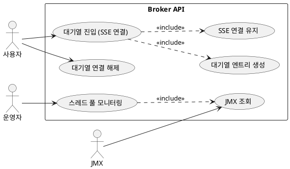

# Broker Module API 문서

- 대상: `broker` 모듈의 모든 엔드포인트
- 기준: 코드 기준 동작/정책/제약사항을 정리

## 목차
- [유저 스토리](#유저-스토리)
- [유스케이스](#유스케이스)
- [정책과 제약사항](#정책과-제약사항)
- [엔드포인트 상세](#엔드포인트-상세)

## 유저 스토리
- 사용자는 이벤트 티켓 대기열에 진입하고 상태를 실시간으로 받고 싶다.
- 운영자는 서버 스레드 풀/메모리 상태를 확인하고 싶다.

## 유스케이스

## 유스케이스 다이어그램

## 유스케이스 기반 이벤트 도출
| 유스케이스 | 이벤트 후보 | 목적 | 사용 여부 | 비고 |
| --- | --- | --- | --- | --- |
| 대기열 진입(SSE 연결) | QueueJoined | 대기열 통계/모니터링 | 미사용(후보) | 부가기능 |
| 대기열 연결 해제 | QueueLeft | 대기열 상태 정합성 | 미사용(후보) | 대기열 어그리거트 밖 처리 |
| 대기열 진입(SSE 연결) | QueuePromoted | 구매 단계 전환 알림 | 미사용(후보) | 대기열 어그리거트 밖 처리 |
| 스레드 풀 모니터링 | MonitoringSnapshotCaptured | 외부 모니터링/알림 | 미사용(후보) | 부가기능 |

- 대기열 진입(SSE 연결)
- 대기열 연결 해제
- 스레드 풀 모니터링

## 정책과 제약사항
- 대기열 진입/해제는 인증 필요 (`@AuthNeeded`)이며 USER 역할만 허용된다.
- 대기열 진입은 SSE(`text/event-stream`)로 응답한다.
- 모니터링 API는 인증 없이 접근 가능하다.

## 엔드포인트 상세
- GET `/api/v1/broker/events/{id}/tickets/waiting`
  - 목적: 대기열 진입 및 SSE 연결
  - 인증: 필요 (`@AuthNeeded`)
  - 권한: `Role.USER`
  - 응답: `SseEmitter`
  - 동작 상세: 대기열 엔트리 생성 후 SSE 연결 유지

- POST `/api/v1/broker/events/{id}/tickets/disconnect`
  - 목적: 대기열 명시적 연결 해제
  - 인증: 필요 (`@AuthNeeded`)
  - 권한: `Role.USER`
  - 응답: `ResponseEntity<Void>`
  - 동작 상세: IN_PROGRESS 도달 후 즉시 호출하여 다음 유저 승급 유도

- GET `/api/v1/monitoring/threadpool`
  - 목적: Tomcat 스레드 풀/메모리 상세 모니터링
  - 인증: 없음
  - 응답: `Map<String, Object>`
  - 동작 상세: JMX 기반 스레드 풀/Executor/메모리 정보 제공

- GET `/api/v1/monitoring/threadpool/summary`
  - 목적: 스레드 풀 요약 정보
  - 인증: 없음
  - 응답: `Map<String, Object>`
  - 동작 상세: 스레드 풀 또는 Executor 중 첫 번째로 조회 가능한 정보를 요약 반환

## 추가 문서
- [Waiting_queue.md](Waiting_queue.md)
