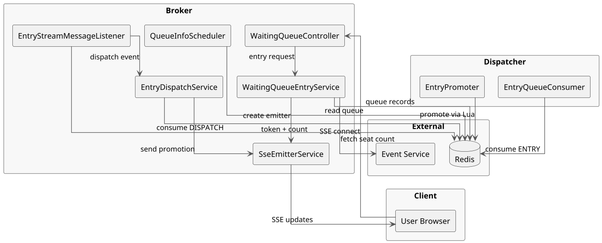
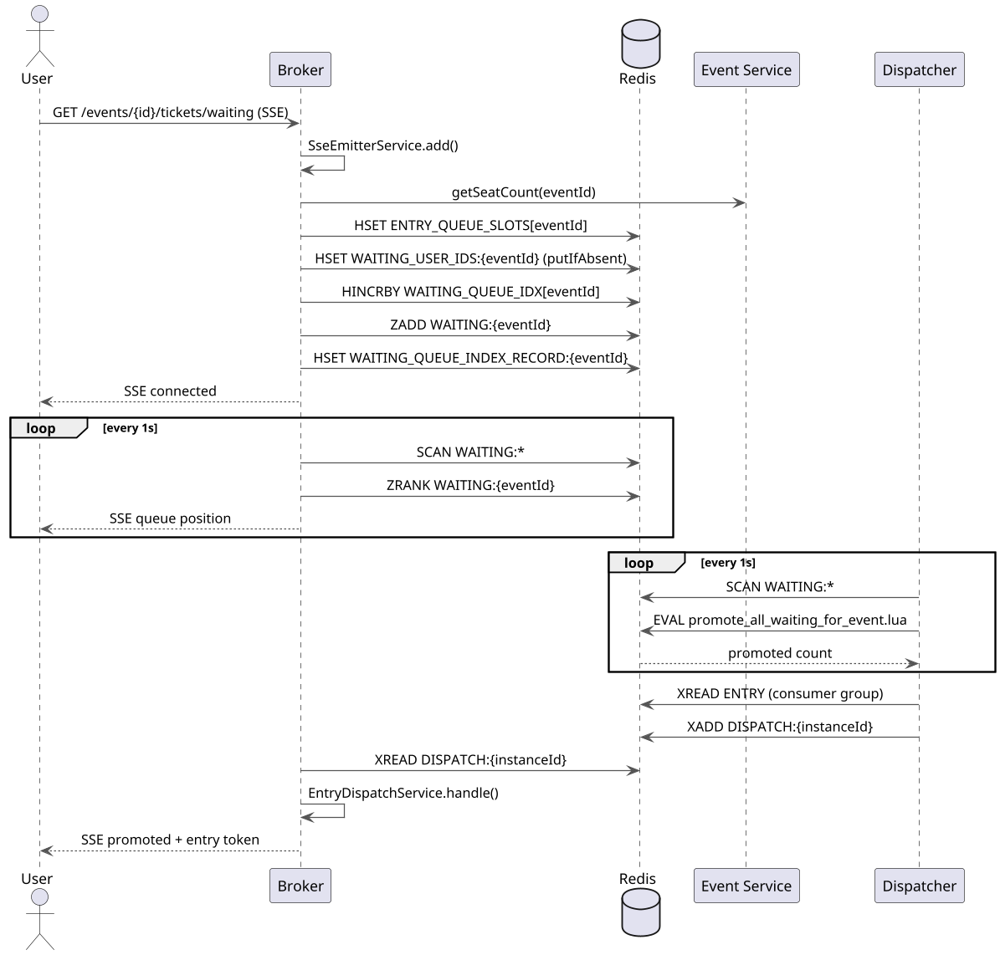
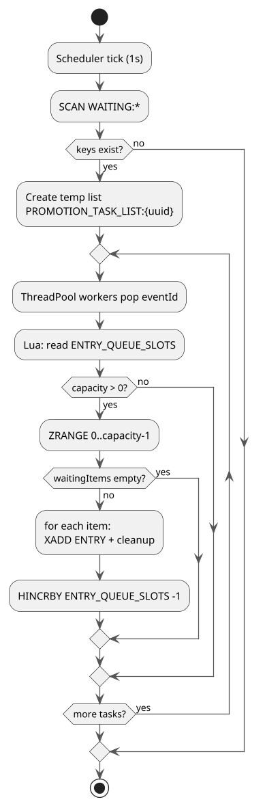
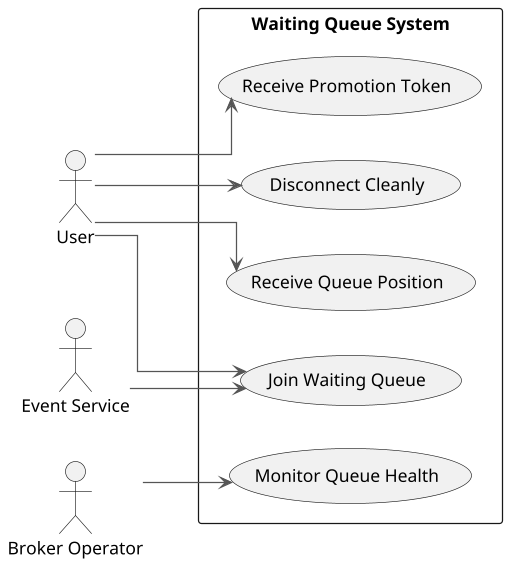

# waiting-entry 대기열 큐 로직 (broker/dispatcher)

## 개요
이 문서는 `broker`와 `dispatcher` 모듈을 기반으로 **waiting-entry 대기열 큐**가 어떻게 동작하는지 로직을 상세히 설명한다. Redis를 단일 상태 저장소로 사용하며, 대기열 진입 → 승격 → SSE 통지까지의 흐름을 분산 인스턴스 환경에서 처리한다.

## 주요 컴포넌트와 아키텍처

## Redis 데이터 모델

| 키 | 타입 | 설명 |
| --- | --- | --- |
| `WAITING:{eventId}` | ZSET | 대기열. `member`는 `{"userId":"..."}` JSON, `score`는 대기 순번(idx) |
| `WAITING_QUEUE_INDEX_RECORD:{eventId}` | HASH | `userId -> {userId,eventId,idx,instanceId}` JSON |
| `WAITING_USER_IDS:{eventId}` | HASH | 중복 진입 방지 (`userId -> true`) |
| `WAITING_QUEUE_IDX` | HASH | 이벤트별 증가 idx 저장 (`eventId -> idx`) |
| `ENTRY_QUEUE_SLOTS` | HASH | 이벤트별 남은 entry 자리 (`eventId -> count`) |
| `ENTRY` | STREAM | 승격된 유저 메시지 |
| `DISPATCH:{instanceId}` | STREAM | 특정 broker 인스턴스로 라우팅된 메시지 |
| `ENTRY_TOKEN:{userId}` | STRING | entry 토큰 (5분 TTL) |

## 핵심 흐름 상세

### 1) 대기열 진입 (broker)
1. `WaitingQueueController`가 `/events/{id}/tickets/waiting` 요청 수신.
2. `WaitingQueueEntryService.entry(eventId)`:
   - `SseEmitterService.add(userId, eventId)`로 SSE 연결 생성 및 저장.
   - `ENTRY_QUEUE_SLOTS`가 없으면 `Event Service`에서 좌석 수 조회 후 초기화.
   - `WAITING_USER_IDS:{eventId}`에 `putIfAbsent`로 중복 진입 방지.
   - `WAITING_QUEUE_IDX` 증가 후 ZSET에 저장.
   - `WAITING_QUEUE_INDEX_RECORD:{eventId}`에 추가 메타 저장(특히 `instanceId`).

### 2) 대기열 상태 브로드캐스트 (broker)
`QueueInfoScheduler`가 1초마다 실행:
1. `SCAN WAITING:*`으로 모든 이벤트 대기열 키 탐색.
2. 각 `WAITING:{eventId}` ZSET을 조회하고, `WAITING_QUEUE_INDEX_RECORD:{eventId}`에서 유저 레코드 로드.
3. `ZRANK`로 현재 순번 계산 후 SSE로 전송.
4. 전송 실패/연결 끊김 시 `SseEmitterService.closeConn`으로 정리.

### 3) 승격 처리 (dispatcher)
`EntryPromoter.promoteToEntryQueue()`가 1초마다 실행:
1. `SCAN WAITING:*`으로 이벤트 목록 수집.
2. 임시 작업 리스트 `PROMOTION_TASK_LIST:{uuid}`에 `eventId` 목록 저장.
3. `ThreadPoolExecutor`로 멀티스레드 처리 (CallerRunsPolicy로 backpressure).
4. 각 스레드는 `promote_all_waiting_for_event.lua` 실행:
   - `ENTRY_QUEUE_SLOTS`를 읽고 승격 가능한 수(capacity)만큼 `ZRANGE`.
   - 각 대기 유저를 `ENTRY` stream에 `XADD`.
   - 대기열/레코드/중복방지 해시에서 제거.
   - `ENTRY_QUEUE_SLOTS`를 감소.

### 4) 승격 통지 (dispatcher -> broker)
1. `EntryQueueConsumer`가 `ENTRY` stream을 소비:
   - 메시지의 `instanceId`로 `DISPATCH:{instanceId}` 스트림에 라우팅.
   - `ENTRY` stream 메시지 ACK.
2. `EntryStreamMessageListener`(broker)가 자신의 `DISPATCH:{instanceId}`만 구독:
   - `EntryDispatchService.handle(userId, eventId)` 호출.
   - 연결이 없으면 `ENTRY_QUEUE_SLOTS`를 1 증가(자리가 다시 비었다고 판단).
   - 연결이 있으면 `Status.IN_PROGRESS`로 전환, 토큰 발급 후 SSE 전송.
   - 메시지를 ACK.

### 5) 연결 해제 및 정리 (broker)
`SseEmitterService`의 `onCompletion/onError/onTimeout` 또는 명시적 `disconnect`:
1. `IN_PROGRESS` 상태라면 `ENTRY_QUEUE_SLOTS`를 1 증가하고 `ENTRY_TOKEN:{userId}` 제거.
2. `IN_ENTRY` 상태라면 대기열 ZSET, 레코드 해시, 중복방지 해시에서 제거.

## 시퀀스 다이어그램 (전체 흐름)

## 액티비티 다이어그램 (승격 로직)

## 유저 스토리
- 대기열에 접속한 사용자로서, 현재 내 순번과 남은 대기 규모를 실시간으로 받고 싶다.
- 대기 중인 사용자로서, 내 차례가 되면 즉시 승격 통지와 구매 토큰을 받고 싶다.
- 연결이 끊긴 사용자로서, 재접속 시 중복 진입 없이 올바른 상태를 유지하고 싶다.
- 운영자로서, 이벤트별로 대기열 승격이 공정하게 처리되는 것을 보장하고 싶다.

## 유스케이스 다이어그램

## 설계 포인트 요약
- **일관성**: Lua 스크립트로 승격·정리를 원자적으로 처리.
- **확장성**: Dispatcher의 멀티스레드 + 임시 작업 리스트로 이벤트별 병렬 처리.
- **라우팅**: `instanceId` 기반 `DISPATCH:{instanceId}` 스트림으로 브로커 인스턴스 분배.
- **복구/정리**: SSE 종료 시 상태에 따라 대기열/entry count/토큰 정리.
- **성능**: `SCAN` 기반 키 탐색으로 Redis 블로킹 최소화.

## 실패/경합 시나리오

| 시나리오 | 증상 | 처리/보상 로직 |
| --- | --- | --- |
| Redis 연결 장애 | 대기열 진입/승격 실패 | 요청 실패 반환, 재시도 정책은 클라이언트/게이트웨이 레이어에서 처리 |
| Dispatcher 승격 중 예외 | 일부 유저만 승격될 위험 | Lua 스크립트는 원자적으로 처리되며, 실패 시 해당 아이템만 제외 후 계속 |
| Broker SSE 끊김 | 클라이언트가 승격 통지를 못 받음 | `IN_PROGRESS` 상태에서 끊기면 `ENTRY_QUEUE_SLOTS` 복구, 토큰 제거 |
| 승격 후 사용자 미연결 | DISPATCH 수신 시 emitter 없음 | `ENTRY_QUEUE_SLOTS` 1 증가로 자리 복구 |
| 중복 진입 | 동일 유저가 여러 요청 | `WAITING_USER_IDS:{eventId}` 해시로 차단 |

## 상태 전이 규칙

| 상태 | 의미 | 이벤트 | 다음 상태 |
| --- | --- | --- | --- |
| `IN_ENTRY` | 대기열에 진입 | Dispatcher 승격 + Broker 통지 | `IN_PROGRESS` |
| `IN_ENTRY` | 대기열 유지 | SSE 종료 | 제거 |
| `IN_PROGRESS` | 구매 가능 상태 | SSE 종료 | 제거 + `ENTRY_QUEUE_SLOTS` 복구 |

## 용량 정책

- `ENTRY_QUEUE_SLOTS[eventId]`는 **잔여 entry 자리**를 의미한다.
- 초기값은 첫 진입 시 `Event Service`의 좌석 수로 설정된다.
- 승격 시마다 1 감소, `IN_PROGRESS` 사용자 이탈 시 1 증가.
- 좌석 수 변경 이벤트가 있는 경우, 운영 측에서 `ENTRY_QUEUE_SLOTS`를 재보정해야 한다.

## 성능/운영 가이드

- `EntryPromoter` 스케줄 주기(기본 1초)는 대기열 규모/승격 처리량에 따라 조정한다.
- `ThreadPoolExecutor`:
  - `core/max`는 CPU 코어와 Redis 처리량을 기준으로 설정한다.
  - `queue-capacity`는 burst 트래픽을 흡수하되 OOM을 피하도록 제한한다.
  - `CallerRunsPolicy`로 backpressure를 유도한다.
- `SCAN` `count` 값은 키 수/메모리 상태에 맞춰 조정한다.
- 모니터링 포인트:
  - Dispatcher: promotion throughput, thread pool queue size, Lua 실행 시간
  - Broker: active SSE connections, queue position broadcast latency
