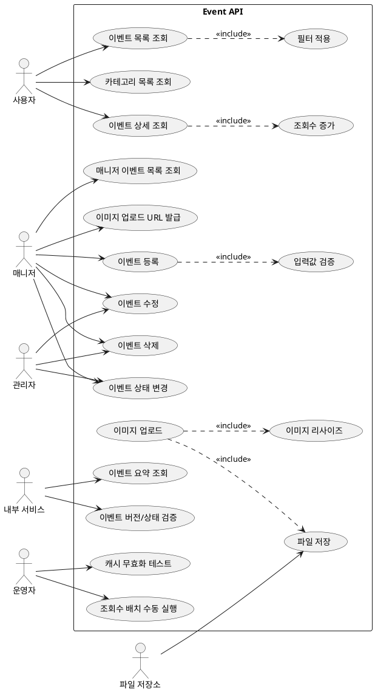

# Event Module API 문서

- 대상: `event` 모듈의 모든 엔드포인트
- 기준: 코드 기준 동작/정책/제약사항을 정리

## 목차
- [유저 스토리](#유저-스토리)
- [유스케이스](#유스케이스)
- [정책과 제약사항](#정책과-제약사항)
- [엔드포인트 상세](#엔드포인트-상세)

## 유저 스토리
- 사용자는 이벤트 목록/상세를 조회하고 싶다.
- 매니저는 이벤트를 생성/수정/삭제/상태변경하고 싶다.
- 매니저는 이벤트 이미지 업로드 URL을 발급받고 싶다.
- 내부 서비스는 이벤트 요약과 버전/상태를 검증하고 싶다.
- 운영자는 조회수 동기화 배치를 수동 실행하고 싶다.

## 유스케이스

## 유스케이스 다이어그램

## 유스케이스 기반 이벤트 도출
| 유스케이스 | 이벤트 후보 | 목적 | 사용 여부 | 비고 |
| --- | --- | --- | --- | --- |
| 이벤트 등록 | EventCreated | 검색/캐시/외부 동기화 | 사용 중 | 이벤트 어그리거트 밖 처리 |
| 이벤트 수정 | EventUpdated | 검색/캐시/외부 동기화 | 미사용(후보) | 이벤트 어그리거트 밖 처리 |
| 이벤트 삭제 | EventDeleted | 검색/캐시/외부 정리 | 미사용(후보) | 이벤트 어그리거트 밖 처리 |
| 이벤트 상태 변경 | EventStatusChanged | 판매/노출 제어 후속 처리 | 미사용(후보) | 이벤트 어그리거트 밖 처리 |
| 이벤트 상세 조회 | EventViewCountIncreased | 조회수 통계/분석 | 미사용(후보) | 부가기능(분석/집계) |
| 이미지 업로드 URL 발급/업로드 | EventImageUploaded | CDN/이미지 파이프라인 처리 | 미사용(후보) | 부가기능 |
| 조회수 배치 수동 실행 | EventViewCountSyncTriggered | 배치/통계 연동 | 미사용(후보) | 부가기능 |

- 이벤트 등록/수정/삭제/상태 변경
- 이벤트 목록/상세 조회
- 매니저 자신의 이벤트 목록 조회
- 카테고리 목록 조회
- 이미지 업로드 URL 발급 및 파일 업로드
- 내부 이벤트 요약/버전 검증
- 캐시 무효화 테스트
- 조회수 배치 수동 실행

## 정책과 제약사항
- 이벤트 등록은 매니저 권한, 수정/삭제/상태 변경은 매니저 또는 관리자 권한이 필요하다.
- 이벤트 목록/상세, 카테고리 목록은 인증 없이 접근 가능하다.
- 이벤트 상세 조회는 조회수 증가를 비동기로 수행한다.
- 이벤트 등록 요청은 필드 검증을 수행한다.
  - title: 길이 2~255
  - description: 공백 불가
  - seatLayout: null 불가
  - startDate: 현재 또는 미래
  - endDate: 현재 이후
  - bookingStart: 현재 또는 미래
  - bookingEnd: 현재 이후
  - ageLimit, minPrice, maxPrice: 0 이상
  - startDate <= endDate, bookingStart <= bookingEnd, minPrice <= maxPrice
- 이벤트 목록 필터는 요청 바디에 전달되며, 값 검증은 타입/어노테이션 기준으로 수행된다.
- 이미지 업로드 URL은 `http://localhost:8080/static/events/images/` 기반으로 생성된다.
- 이미지 업로드(파일 저장)는 `.webp` 확장자만 허용, 10MB 제한, 최대 1920x1080 리사이즈 후 저장된다.
- 내부 API(`/internal/**`)와 테스트/배치 API는 인증이 없다.

## 엔드포인트 상세
- POST `/api/v1/events`
  - 목적: 이벤트 등록
  - 인증: 필요 (`@AuthNeeded`)
  - 권한: `Role.MANAGER`
  - 요청 바디: `NewEventRequest`
  - 응답: `RsData<EventId>`

- PUT `/api/v1/events/{eventId}`
  - 목적: 이벤트 수정
  - 인증: 필요 (`@AuthNeeded`)
  - 권한: `Role.MANAGER`, `Role.ADMIN`
  - 요청 바디: `UpdateEventRequest`
  - 응답: `RsData<EventId>`

- DELETE `/api/v1/events/{eventId}`
  - 목적: 이벤트 삭제
  - 인증: 필요 (`@AuthNeeded`)
  - 권한: `Role.MANAGER`, `Role.ADMIN`
  - 응답: `RsData<Void>`

- PATCH `/api/v1/events/{eventId}`
  - 목적: 이벤트 상태 변경
  - 인증: 필요 (`@AuthNeeded`)
  - 권한: `Role.MANAGER`, `Role.ADMIN`
  - 요청 쿼리: `status` (문자열)
  - 응답: `RsData<EventId>`

- POST `/api/v1/events/list`
  - 목적: 이벤트 목록 조회
  - 인증: 없음
  - 요청 쿼리: `keyword` (선택)
  - 요청 바디: `EventListFilter` (선택)
  - 응답: `RsData<Page<EventListProjection>>`

- GET `/api/v1/events/{id}`
  - 목적: 이벤트 상세 조회
  - 인증: 없음
  - 응답: `RsData<EventListProjection>`
  - 동작 상세: 조회수 증가를 비동기로 수행

- GET `/api/v1/events/manager/me`
  - 목적: 매니저 본인 이벤트 목록 조회
  - 인증: 필요 (`@AuthNeeded`)
  - 권한: `Role.MANAGER`
  - 응답: `RsData<Page<EventListProjection>>`

- GET `/api/v1/categories`
  - 목적: 카테고리 목록 조회
  - 인증: 없음
  - 응답: `RsData<List<EventCategoryListResponse>>`

- POST `/api/v1/events/image/url`
  - 목적: 이미지 업로드 URL 생성
  - 인증: 필요 (`@AuthNeeded`)
  - 권한: `Role.MANAGER`
  - 요청 바디: `FileUploadRequest` (fileNames)
  - 응답: `RsData<List<PresignedUrlResponse>>`
  - 동작 상세: 파일명 + 현재시간을 SHA-256 해싱 후 16자리로 축약한 이름 사용

- PUT `/static/events/images/{fileName}`
  - 목적: 이벤트 이미지 업로드
  - 인증: 없음
  - 요청 바디: 바이너리 (byte[])
  - 응답: `RsData<String>` (저장된 파일명)
  - 정책: `.webp`만 허용, 최대 10MB, 1920x1080 이하 리사이즈

- GET `/internal/events/{eventId}/summary`
  - 목적: 이벤트 요약 정보 조회
  - 인증: 없음
  - 응답: `EventSummaryResponse` (eventId, seatLayoutId, seatSelectable, status, version, title)

- GET `/internal/events/{eventId}/version-check`
  - 목적: 이벤트 버전/상태 유효성 확인
  - 인증: 없음
  - 요청 쿼리: `version`, `status`
  - 응답: `Boolean`

- POST `/api/v1/test/cache-invalidation`
  - 목적: 캐시 무효화 이벤트 발행 테스트
  - 인증: 없음
  - 응답: `RsData<String>`

- POST `/api/v1/batch/viewcount-sync`
  - 목적: 조회수 동기화 배치 수동 실행
  - 인증: 없음
  - 응답: `RsData<String>`
