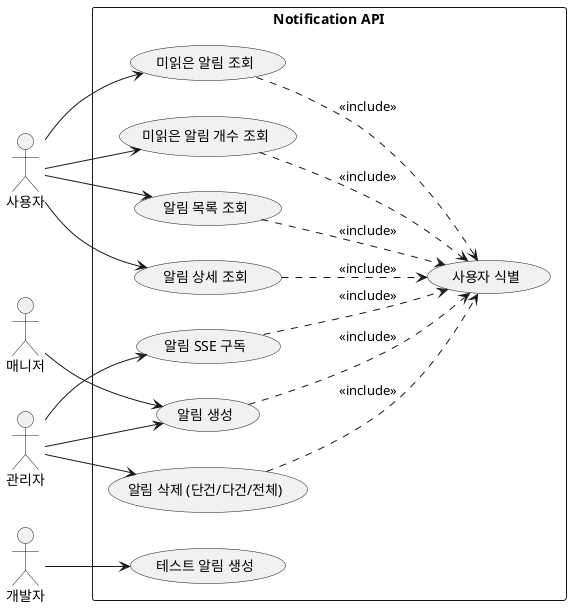

# Notification Module API 문서

- 대상: `notification` 모듈의 모든 엔드포인트
- 기준: 코드 기준 동작/정책/제약사항을 정리

## 목차
- [유저 스토리](#유저-스토리)
- [유스케이스](#유스케이스)
- [정책과 제약사항](#정책과-제약사항)
- [엔드포인트 상세](#엔드포인트-상세)

## 유저 스토리
- 사용자는 알림 목록/상세/미읽음 개수를 조회하고 싶다.
- 관리자는 알림을 생성/삭제하고 SSE로 수신하고 싶다.
- 개발자는 알림 기능을 테스트하고 싶다.

## 유스케이스

## 유스케이스 다이어그램

## 유스케이스 기반 이벤트 도출
| 유스케이스 | 이벤트 후보 | 목적 | 사용 여부 | 비고 |
| --- | --- | --- | --- | --- |
| 알림 생성 | NotificationCreated | SSE/푸시 발송 트리거 | 발행만 | 알림 어그리거트 밖 처리 |
| 알림 상세 조회 | NotificationRead | 읽음 처리 통계/배지 갱신 | 미사용(후보) | 부가기능 |
| 알림 삭제 | NotificationDeleted | 클라이언트 동기화 | 미사용(후보) | 부가기능 |
| 알림 SSE 구독 | NotificationSubscriptionStarted | 연결 모니터링/세션 관리 | 미사용(후보) | 부가기능 |

- 알림 목록 조회
- 알림 상세 조회
- 미읽은 알림 조회
- 알림 SSE 구독
- 알림 생성/삭제 (단건/다건/전체)
- 미읽은 알림 개수 조회
- 테스트 알림 생성

## 정책과 제약사항
- 목록/미읽음/미읽음 개수 조회는 인증 필요이며 USER 역할만 허용된다.
- 알림 생성/삭제/구독은 ADMIN 또는 MANAGER 권한이 필요하다.
- 알림 상세 조회는 컨트롤러에 `@AuthNeeded`가 없지만 내부에서 로그인 컨텍스트를 사용한다.
- 테스트 알림 생성 API는 인증이 없다.

## 엔드포인트 상세
- GET `/api/v1/notifications`
  - 목적: 알림 목록 조회
  - 인증: 필요 (`@AuthNeeded`)
  - 권한: `Role.USER`
  - 요청: `pageable` (기본 size=10, sort=sentAt)
  - 응답: `RsData<Page<NotificationListProjection>>`

- GET `/api/v1/notifications/{id}`
  - 목적: 알림 상세 조회
  - 인증: 컨트롤러 어노테이션 없음
  - 요청: `id` 경로 변수
  - 응답: `RsData<NotificationDto>`

- POST `/api/v1/notifications`
  - 목적: 알림 생성
  - 인증: 필요 (`@AuthNeeded`)
  - 권한: `Role.ADMIN`, `Role.MANAGER`
  - 요청 바디: `NotificationCreateRequestDto` (userId, type, title, content, targetUrl)
  - 응답: `RsData<NotificationDto>`

- GET `/api/v1/notifications/unread`
  - 목적: 미읽은 알림 조회
  - 인증: 필요 (`@AuthNeeded`)
  - 권한: `Role.USER`
  - 요청: `pageable` (기본 size=20, sort=sentAt DESC)
  - 응답: `RsData<Page<NotificationListProjection>>`

- GET `/api/v1/notifications/subscribe`
  - 목적: 알림 SSE 구독
  - 인증: 필요 (`@AuthNeeded`)
  - 권한: `Role.ADMIN`
  - 요청 헤더: `Last-Event-ID` (선택)
  - 응답: `SseEmitter`

- DELETE `/api/v1/notifications/{id}`
  - 목적: 알림 단일 삭제
  - 인증: 필요 (`@AuthNeeded`)
  - 권한: `Role.ADMIN`
  - 응답: `RsData<Void>`

- POST `/api/v1/notifications/batch-delete`
  - 목적: 알림 다건 삭제
  - 인증: 필요 (`@AuthNeeded`)
  - 권한: `Role.ADMIN`
  - 요청 바디: `NotificationDeleteRequestDto` (notificationIds)
  - 응답: `RsData<Void>`

- DELETE `/api/v1/notifications/all`
  - 목적: 알림 전체 삭제
  - 인증: 필요 (`@AuthNeeded`)
  - 권한: `Role.ADMIN`
  - 응답: `RsData<Void>`

- GET `/api/v1/notifications/count/unread`
  - 목적: 미읽은 알림 개수 조회
  - 인증: 필요 (`@AuthNeeded`)
  - 권한: `Role.USER`
  - 응답: `RsData<Long>`

- POST `/api/v1/notifications/test`
  - 목적: 테스트 알림 생성
  - 인증: 없음
  - 요청 쿼리: `userId`, `type` (기본 SYSTEM), `title`, `content`
  - 응답: `RsData<NotificationDto>`

- (주석 처리) `/api/v1/test-notifications`
  - 컨트롤러는 존재하지만 모든 메서드가 주석 처리되어 있어 실동작 엔드포인트가 없다.
