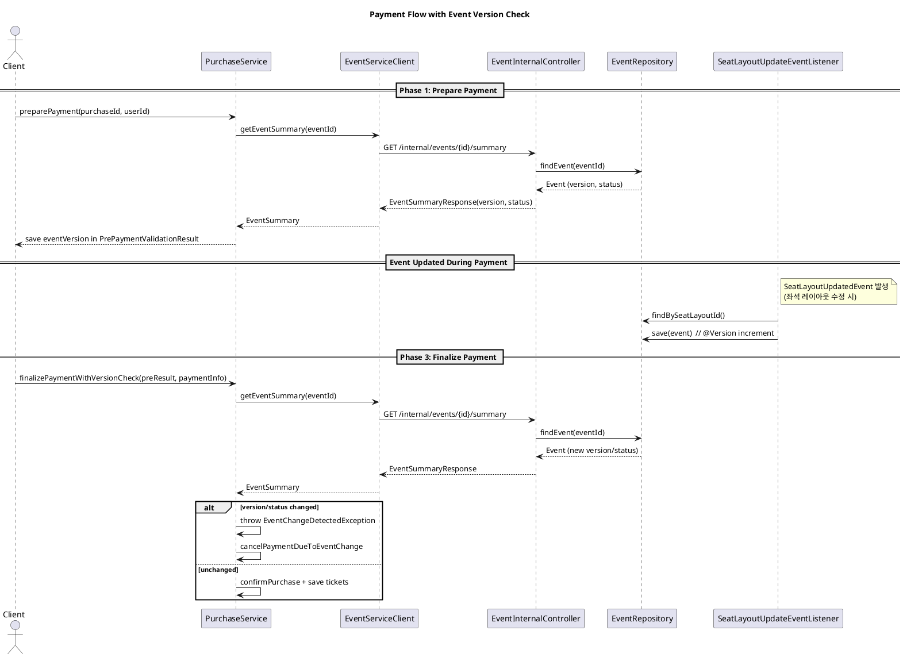

# 결제 진행 중 이벤트 변경 감지 흐름

이 문서는 결제 진행 중 이벤트가 변경될 때 이를 감지하고 결제를 취소하는 흐름을 설명합니다.

## 개요

- 결제 준비 단계에서 이벤트 `version`을 저장합니다.
- 결제 최종 단계에서 이벤트 `version`과 `status`를 다시 확인합니다.
- 결제 중 이벤트가 변경되면 `EventChangeDetectedException`으로 감지하고 결제를 취소합니다.

## 플로우 다이어그램 (PlantUML)

## 주요 구현 지점

- 결제 준비 단계에서 이벤트 버전 저장
  - `purchase/src/main/java/org/codenbug/purchase/app/PurchaseService.java`
  - `preparePayment()`에서 `event.getVersion()`을 `PrePaymentValidationResult`에 저장

- 결제 최종 단계에서 이벤트 버전/상태 재검증
  - `purchase/src/main/java/org/codenbug/purchase/app/PurchaseService.java`
  - `finalizePaymentWithVersionCheck()`에서 현재 버전과 상태를 비교하고 변경 시 예외 처리

- 결제 중 이벤트 변경을 버전 증가로 반영
  - `event/src/main/java/org/codenbug/event/infra/SeatLayoutUpdateEventListener.java`
  - `SeatLayoutUpdatedEvent` 수신 시 `eventRepository.save(event)`로 `@Version` 증가

- 이벤트 요약 정보 제공 API
  - `event/src/main/java/org/codenbug/event/ui/EventInternalController.java`
  - `/internal/events/{id}/summary`에서 `version` 포함 응답

- 결제 서비스의 이벤트 조회
  - `purchase/src/main/java/org/codenbug/purchase/infra/client/EventServiceClient.java`
  - `EventSummaryResponse`를 `EventSummary`로 변환

## 참고 사항

- 현재 버전 증가 트리거는 `SeatLayoutUpdatedEvent` 기반입니다.
- 이벤트 수정 시 버전 증가가 필요하다면, 수정 로직에서도 버전 갱신을 고려해야 합니다.
