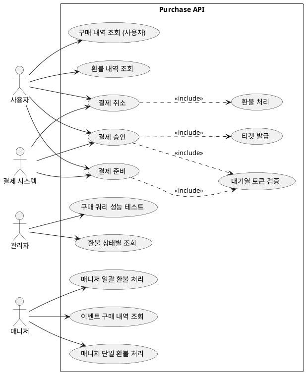

# Purchase Module API 문서

- 대상: `purchase` 모듈의 모든 엔드포인트
- 기준: 코드 기준 동작/정책/제약사항을 정리

## 목차
- [유저 스토리](#유저-스토리)
- [유스케이스](#유스케이스)
- [정책과 제약사항](#정책과-제약사항)
- [엔드포인트 상세](#엔드포인트-상세)

## 유저 스토리
- 사용자는 결제를 준비하고 승인하여 티켓을 구매하고 싶다.
- 사용자는 결제를 취소(환불)하고 싶다.
- 사용자는 자신의 구매/환불 내역을 조회하고 싶다.
- 관리자는 이벤트 단위 구매 내역과 환불을 관리하고 싶다.

## 유스케이스

## 유스케이스 다이어그램

## 유스케이스 기반 이벤트 도출
| 유스케이스 | 이벤트 후보 | 목적 | 사용 여부 | 비고 |
| --- | --- | --- | --- | --- |
| 결제 준비 | PaymentInitiated | 부정거래 탐지/결제 추적 | 미사용(후보) | 부가기능 |
| 결제 승인 | PaymentConfirmed | 좌석 확정/티켓 발급 | 미사용(후보) | 구매 어그리거트 밖 처리 |
| 결제 승인 | TicketIssued | 티켓 전달/알림 | 미사용(후보) | 부가기능 |
| 결제 취소 | PaymentCanceled | 좌석 복원/회계 처리 | 미사용(후보) | 구매 어그리거트 밖 처리 |
| 환불 처리 | RefundCompleted | 알림/정산 연동 | 사용 중 | 구매 어그리거트 밖 처리 |
| 매니저 단일 환불 처리 | ManagerRefundCompleted | 알림/감사 로그 | 사용 중 | 부가기능 |
| 매니저 일괄 환불 처리 | RefundBatchProcessed | 알림/통계 | 미사용(후보) | 부가기능 |

- 결제 준비
- 결제 승인
- 결제 취소
- 구매 내역 조회 (사용자)
- 구매 내역 조회 (이벤트/관리자)
- 환불 내역 조회
- 관리자 환불 처리 (단일/일괄)
- 환불 상태별 조회

## 정책과 제약사항
- 결제 준비/승인 API는 인증 필요 (`@AuthNeeded`)이며 USER 역할만 허용된다.
- 결제 준비/승인 API는 `entryAuthToken` 헤더 검증을 요구한다.
- 결제 취소 API는 컨트롤러에 `@AuthNeeded`/`@RoleRequired`가 없지만 내부에서 로그인 컨텍스트를 사용한다.
- 구매 내역 조회는 인증 필요. 사용자 조회는 USER, 이벤트 조회는 MANAGER 역할 필요.
- 환불 관련 API는 컨트롤러에 인증/권한 어노테이션이 없다.

## 엔드포인트 상세
- POST `/api/v1/payments/init`
  - 목적: 결제 준비
  - 인증: 필요 (`@AuthNeeded`)
  - 권한: `Role.USER`
  - 요청 헤더: `entryAuthToken`
  - 요청 바디: `InitiatePaymentRequest` (eventId, orderId, amount)
  - 응답: `RsData<InitiatePaymentResponse>`

- POST `/api/v1/payments/confirm`
  - 목적: 결제 승인 및 티켓 발급
  - 인증: 필요 (`@AuthNeeded`)
  - 권한: `Role.USER`
  - 요청 헤더: `entryAuthToken`
  - 요청 바디: `ConfirmPaymentRequest` (purchaseId, paymentKey, orderId, amount)
  - 응답: `RsData<ConfirmPaymentResponse>`

- POST `/api/v1/payments/{paymentKey}/cancel`
  - 목적: 결제 취소 및 환불 처리
  - 인증: 컨트롤러 어노테이션 없음
  - 요청 바디: `CancelPaymentRequest` (cancelReason)
  - 응답: `RsData<CancelPaymentResponse>`

- GET `/api/v1/purchases/history`
  - 목적: 사용자 구매 내역 조회
  - 인증: 필요 (`@AuthNeeded`)
  - 권한: `Role.USER`
  - 요청 쿼리: `statuses` (기본값: DONE, EXPIRED), `pageable`
  - 응답: `RsData<Page<PurchaseListProjection>>`

- GET `/api/v1/purchases/event/{eventId}`
  - 목적: 이벤트 구매 내역 조회
  - 인증: 필요 (`@AuthNeeded`)
  - 권한: `Role.MANAGER`
  - 요청 쿼리: `status` (기본값: DONE), `pageable`
  - 응답: `RsData<Page<PurchaseListProjection>>`

- GET `/api/v1/refunds/my`
  - 목적: 내 환불 내역 조회
  - 인증: 없음
  - 요청 쿼리: `userId`, `pageable`
  - 응답: `Page<RefundQueryService.RefundDto>`

- GET `/api/v1/refunds/{refundId}`
  - 목적: 특정 환불 상세 조회
  - 인증: 없음
  - 요청: `refundId` 경로 변수, `userId` 쿼리
  - 응답: `RefundQueryService.RefundDto`

- POST `/api/v1/refunds/manager/single`
  - 목적: 매니저 단일 환불 처리
  - 인증: 없음
  - 요청 바디: `ManagerRefundRequest` (purchaseId, refundReason, managerId, managerName)
  - 응답: `ManagerRefundService.ManagerRefundResult`

- POST `/api/v1/refunds/manager/batch`
  - 목적: 매니저 일괄 환불 처리 (이벤트 단위)
  - 인증: 없음
  - 요청 바디: `BatchRefundRequest` (eventId, refundReason, managerId, managerName)
  - 응답: `List<ManagerRefundService.ManagerRefundResult>`

- GET `/api/v1/refunds/admin/by-status`
  - 목적: 환불 상태별 조회
  - 인증: 없음
  - 요청 쿼리: `status` (RefundStatus)
  - 응답: `List<RefundQueryService.RefundDto>`

- GET `/api/test/purchase/original/{eventId}`
  - 목적: 기존 JPQL 쿼리 테스트
  - 인증: 없음
  - 응답: 문자열

- GET `/api/test/purchase/optimized/{eventId}`
  - 목적: QueryDSL 최적화 쿼리 테스트
  - 인증: 없음
  - 응답: 문자열

- GET `/api/test/purchase/compare/{eventId}`
  - 목적: 두 쿼리 성능 비교 테스트
  - 인증: 없음
  - 응답: 문자열

- GET `/api/test/purchase/events`
  - 목적: 테스트용 이벤트 ID 안내
  - 인증: 없음
  - 응답: 문자열

## 추가 문서
- [purchaseMultiThread.md](purchaseMultiThread.md)
- [payment-flow.md](payment-flow.md)
- [payment-event-version-check.md](payment-event-version-check.md)
