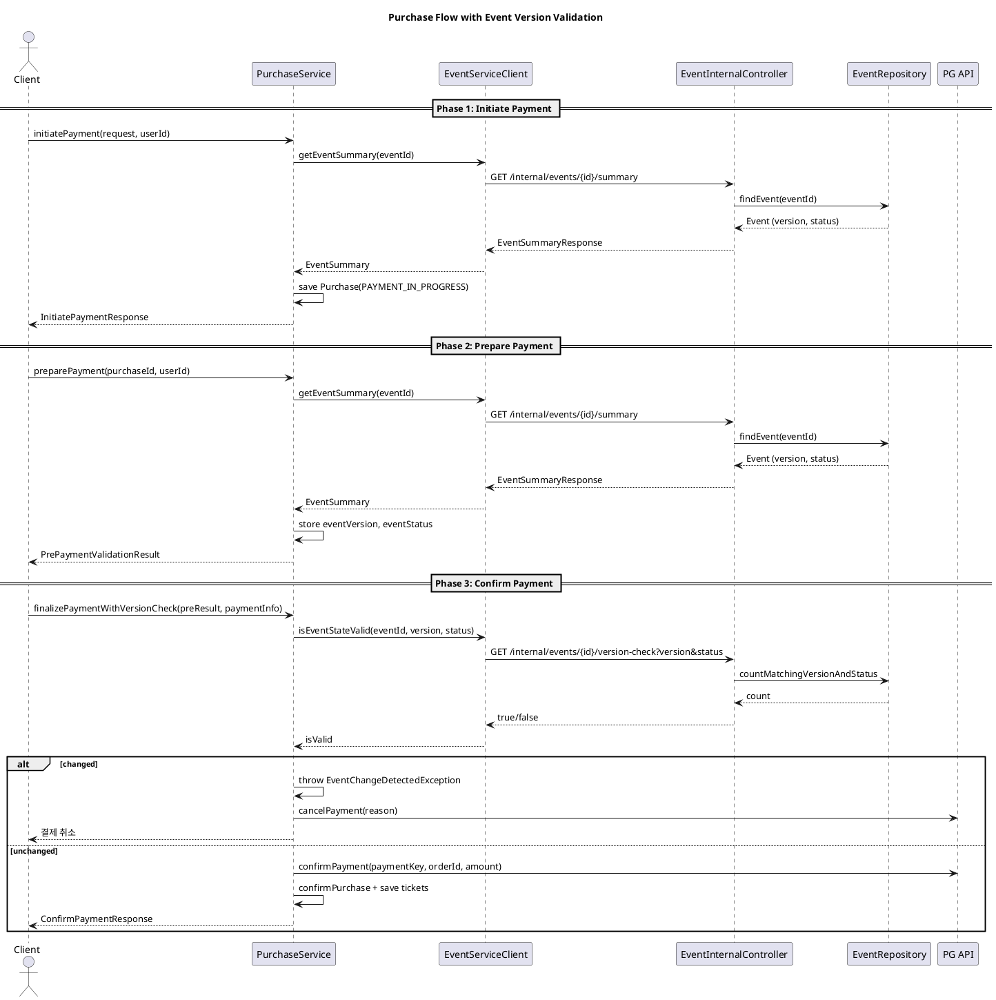

# 결제 플로우 (이벤트 변경 감지 포함)

이 문서는 결제 진행 중 이벤트 변경을 감지하는 흐름을 포함한 결제 플로우를 설명합니다.

## 플로우 다이어그램 (PlantUML)

## 핵심 동작

- 결제 준비 단계에서 이벤트 `version`/`status`를 저장합니다.
- 결제 최종 단계에서 이벤트 서비스에 버전/상태 검증을 요청합니다.
- 검증 실패 시 결제를 자동 취소합니다.

## 주요 구현 위치

- 이벤트 버전/상태 검증 API
  - `event/src/main/java/org/codenbug/event/ui/EventInternalController.java`

- 이벤트 검증 쿼리
  - `event/src/main/java/org/codenbug/event/infra/JpaEventRepository.java`

- 결제 최종 단계 검증 호출
  - `purchase/src/main/java/org/codenbug/purchase/app/PurchaseService.java`
  - `purchase/src/main/java/org/codenbug/purchase/infra/client/EventServiceClient.java`

## 유스케이스

| ID | 유스케이스 | 설명 | 주요 결과 |
| --- | --- | --- | --- |
| UC-01 | 결제 시작 | 이벤트 유효성을 확인하고 결제 준비 정보를 생성 | 결제 ID 생성, 상태 IN_PROGRESS |
| UC-02 | 결제 준비 | 결제 전 이벤트 상태/버전을 확인하고 스냅샷 저장 | eventVersion, eventStatus 저장 |
| UC-03 | 결제 확정 | 이벤트 변경 여부를 검증하고 결제 확정 또는 취소 | 확정 시 티켓 발급, 변경 시 취소 |

## 유저 스토리

| ID | 유저 스토리 | 기대 가치 |
| --- | --- | --- |
| US-01 | 구매자는 결제를 시작하기 전에 이벤트가 유효한지 확인받고 싶다 | 유효하지 않은 이벤트로 인한 결제 실패 최소화 |
| US-02 | 구매자는 결제 중 이벤트가 바뀌면 자동으로 결제가 취소되길 원한다 | 변경된 조건에서의 구매 위험 방지 |
| US-03 | 운영자는 이벤트 변경이 결제에 반영되도록 보장하고 싶다 | 일관성 있는 결제 처리 |

## 메서드 설명

| 메서드 | 역할 | 입력 | 출력 | 실패 처리 |
| --- | --- | --- | --- | --- |
| `PurchaseService.initiatePayment` | 결제 사전 등록 및 이벤트 유효성 확인 | `InitiatePaymentRequest`, `userId` | `InitiatePaymentResponse` | 이벤트 미존재/금액 오류 시 예외 |
| `PurchaseService.preparePayment` | 이벤트 상태 확인 및 버전 스냅샷 저장 | `purchaseId`, `userId` | `PrePaymentValidationResult` | 이벤트 상태가 OPEN이 아니면 예외 |
| `PurchaseService.finalizePaymentWithVersionCheck` | 이벤트 변경 검증 후 결제 확정/취소 | `PrePaymentValidationResult`, `paymentInfo`, `userId` | `ConfirmPaymentResponse` | 변경 감지 시 결제 취소 및 예외 |
| `EventServiceClient.getEventSummary` | 이벤트 요약 조회 | `eventId` | `EventSummary` | 미존재 시 예외 |
| `EventServiceClient.isEventStateValid` | 버전/상태 정합성 검증 | `eventId`, `version`, `status` | `boolean` | 검증 실패 시 `false` |
| `EventInternalController.getEventSummary` | 내부 이벤트 요약 API | `eventId` | `EventSummaryResponse` | 미존재 시 404 |
| `EventInternalController.validateEventVersion` | 내부 버전 검증 API | `eventId`, `version`, `status` | `boolean` | 잘못된 status면 `false` |
| `JpaEventRepository.countMatchingVersionAndStatus` | DB 조건 검증 | `eventId`, `version`, `status` | `count` | 0이면 변경됨 |
