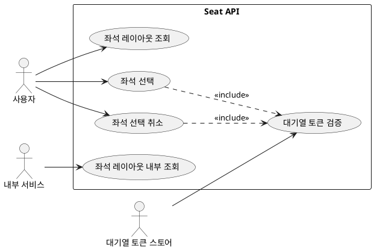

# Seat Module API 문서

- 대상: `seat` 모듈의 모든 엔드포인트
- 기준: 코드 기준 동작/정책/제약사항을 정리

## 목차
- [유저 스토리](#유저-스토리)
- [유스케이스](#유스케이스)
- [정책과 제약사항](#정책과-제약사항)
- [엔드포인트 상세](#엔드포인트-상세)

## 유저 스토리
- 사용자는 이벤트 좌석을 조회하고 선택/취소하고 싶다.
- 내부 서비스는 좌석 레이아웃 정보를 직접 조회하고 싶다.

## 유스케이스

## 유스케이스 다이어그램

## 유스케이스 기반 이벤트 도출
| 유스케이스 | 이벤트 후보 | 목적 | 사용 여부 | 비고 |
| --- | --- | --- | --- | --- |
| 좌석 선택 | SeatSelected | 결제/구매 흐름 확정 처리 | 미사용(후보) | 좌석 어그리거트 밖 처리 |
| 좌석 선택 | SeatHoldExpired | 대기열/구매 만료 보상 | 미사용(후보) | 부가기능(만료/정리) |
| 좌석 선택 취소 | SeatSelectionCanceled | 구매/대기열 보상 처리 | 미사용(후보) | 좌석 어그리거트 밖 처리 |
| 좌석 레이아웃 조회 | 없음 | 조회만으로는 부가기능 연계 없음 | 해당 없음 | - |
| 좌석 레이아웃 내부 조회 | 없음 | 내부 조회 결과만 반환 | 해당 없음 | - |

- 좌석 레이아웃 조회
- 좌석 선택
- 좌석 선택 취소
- 좌석 레이아웃 내부 조회

## 정책과 제약사항
- 좌석 조회/선택은 인증 필요 (`@AuthNeeded`)이며 USER 역할만 허용된다.
- 좌석 선택/취소는 `entryAuthToken` 헤더 검증을 요구한다.
- 좌석 취소 API는 컨트롤러에 `@AuthNeeded`/`@RoleRequired`가 없지만 내부에서 로그인 컨텍스트를 사용한다.
- 내부 레이아웃 조회 API는 인증이 없다.

## 엔드포인트 상세
- GET `/api/v1/events/{event-id}/seats`
  - 목적: 이벤트 좌석 레이아웃 조회
  - 인증: 필요 (`@AuthNeeded`)
  - 권한: `Role.USER`
  - 응답: `RsData<SeatLayoutResponse>`

- POST `/api/v1/events/{event-id}/seats`
  - 목적: 좌석 선택
  - 인증: 필요 (`@AuthNeeded`)
  - 권한: `Role.USER`
  - 요청 헤더: `entryAuthToken`
  - 요청 바디: `SeatSelectRequest` (seatList, ticketCount)
  - 응답: `RsData<SeatSelectResponse>`

- DELETE `/api/v1/events/{event-id}/seats`
  - 목적: 좌석 선택 취소
  - 인증: 컨트롤러 어노테이션 없음
  - 요청 헤더: `entryAuthToken`
  - 요청 바디: `SeatCancelRequest` (seatList)
  - 응답: `RsData<Void>`

- GET `/internal/seat-layouts/{layout-id}`
  - 목적: 좌석 레이아웃 내부 조회
  - 인증: 없음
  - 응답: `SeatLayoutResponse`
