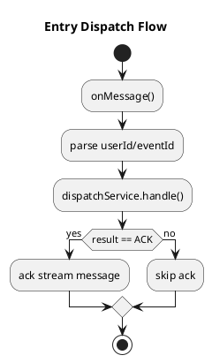

# EntryStreamMessageListener 책임 분리

## 문제
- `EntryStreamMessageListener`가 스트림 소비 외에도 토큰 발급/저장, 상태 정리, SSE 이벤트 발송까지 직접 수행한다.
- 리스너가 도메인/보안 로직을 모두 담당하면서 결합도가 높아지고 테스트/유지보수가 어렵다.

## 해결
- 메시지 소비/ack와 도메인 처리를 분리한다.
- 리스너는 메시지 파싱과 ack 결정만 담당한다.
- 도메인 처리 로직은 별도의 서비스로 이동한다.

## 변경 사항
- `broker/src/main/java/org/codenbug/broker/app/EntryDispatchService.java`
  - SSE 연결 상태 판단, 토큰 발급/저장, 상태 정리 담당
- `broker/src/main/java/org/codenbug/broker/infra/EntryStreamMessageListener.java`
  - 리스닝/ack 오케스트레이션 담당

## 로직 흐름 (PlantUML)

