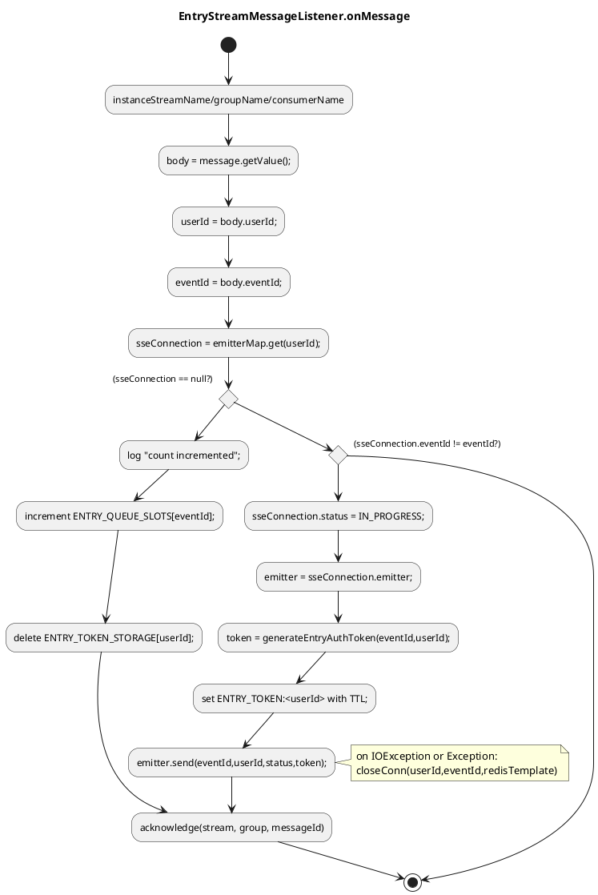

# Entry DISPATCH 수신 시 SSE null로 인한 NPE 및 pending 누적

## 문제
- DISPATCH 메시지를 받은 시점에 `sseConnection`이 `null`일 수 있다.
- 이는 heartbeat 콜백으로 인해 연결 해제 시 `sseConnection` 삭제가 먼저 발생하는 레이스 때문이다.
- 과거 코드에서는 `sseConnection == null` 이후에도 `sseConnection.getEventId()`를 호출해 NPE가 발생할 수 있었다.

## 재현 조건
- 유저가 연결을 끊거나 heartbeat가 끊어져 `sseConnection`이 제거된 직후
- broker가 DISPATCH 메시지를 수신하는 경우

## 영향
- NPE 발생
- ack 누락으로 pending 메시지 누적
- 유저 상태 승급(ACK) 처리가 지연되거나 재처리 필요

## 해결 방법 (현재 코드 반영)
- `sseConnection == null`이면 정리 로직 후 **즉시 ACK**하고 종료한다. (NPE 방지)
- `eventId` 불일치 케이스는 `SKIP_ACK`로 반환하여 ACK하지 않는다.

## 관련 코드
- `broker/src/main/java/org/codenbug/broker/infra/EntryStreamMessageListener.java`
  - `EntryDispatchService.handle(...)` 결과가 `ACK`일 때만 `acknowledge(...)` 실행
- `broker/src/main/java/org/codenbug/broker/app/EntryDispatchService.java`
  - `sseConnection == null` 처리 후 즉시 `ACK` 반환

