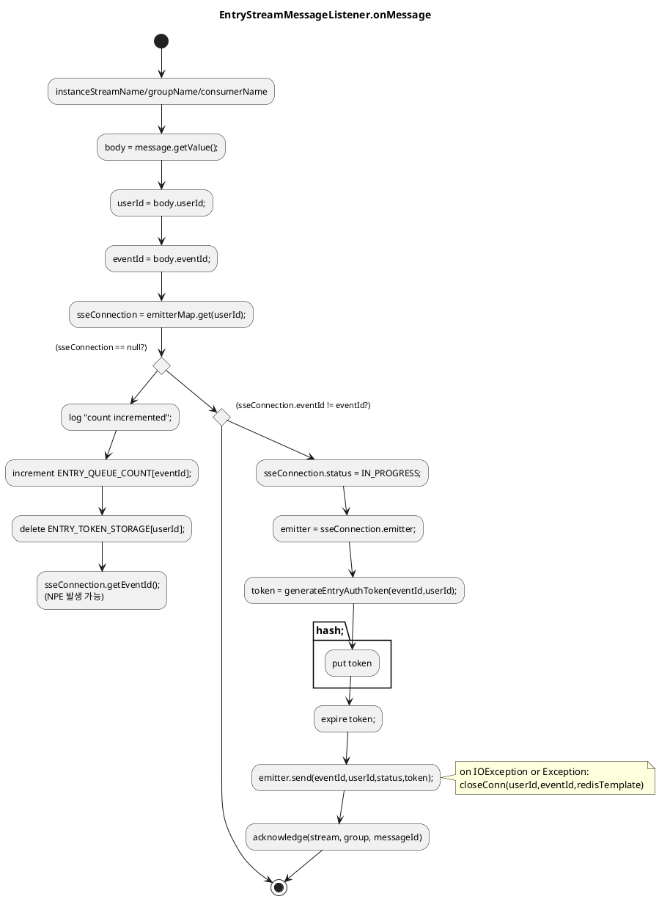

# Entry DISPATCH 수신 시 SSE null로 인한 NPE 및 pending 누적

## 문제
- DISPATCH 메시지를 받은 시점에 `sseConnection`이 `null`일 수 있다.
- 이는 heartbeat 콜백으로 인해 연결 해제 시 `sseConnection` 삭제가 먼저 발생하는 레이스 때문이다.
- `sseConnection == null` 처리 이후에도 `sseConnection.getEventId()`를 호출하면 NPE가 발생한다.
- NPE로 인해 Redis Stream ack가 수행되지 않으면 메시지가 pending에 남을 수 있다.

## 재현 조건
- 유저가 연결을 끊거나 heartbeat가 끊어져 `sseConnection`이 제거된 직후
- broker가 DISPATCH 메시지를 수신하는 경우

## 영향
- NPE 발생
- ack 누락으로 pending 메시지 누적
- 유저 상태 승급(ACK) 처리가 지연되거나 재처리 필요

## 해결 방법
- `sseConnection == null`일 때는 정리 로직을 수행한 뒤 **즉시 ack 후 return**한다.
- `eventId` 불일치 케이스도 필요 시 ack 처리하여 stale 메시지가 pending에 남지 않도록 한다.

## 관련 코드
- `broker/src/main/java/org/codenbug/broker/infra/EntryStreamMessageListener.java`
  - `onMessage()`에서 null 가드 후 `acknowledge(...)` 실행

