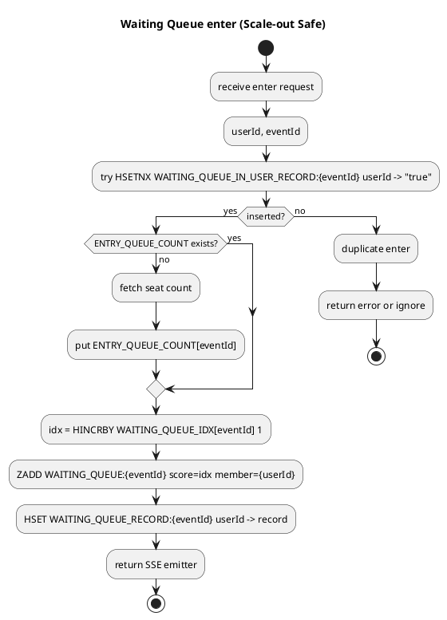

# WAITING_QUEUE_IN_USER_RECORD 미사용으로 인한 중복 대기열 진입

## 문제
- WAITING_QUEUE_IN_USER_RECORD가 실제로 추가되는 로직이 없다.
- 중복 진입 방지와 Lua 스크립트의 정리(HDEL)가 무의미해져 동일 유저가 중복으로 대기열에 들어갈 수 있다.
- broker가 scale out되면 여러 인스턴스에서 동시에 진입 요청을 처리해 중복이 더 쉽게 발생한다.

## 원인
- `WaitingQueueEntryService.enter()`에서 중복 확인/기록 로직이 주석 처리되어 있음.
- `WAITING_QUEUE_IN_USER_RECORD`는 정리만 되고 생성되지 않아 상태 일관성이 깨짐.

## 영향
- 동일 유저의 대기열 엔트리가 여러 개 생성될 수 있음.
- 승격/정리 로직이 기대대로 동작하지 않음(유저 상태 불일치, 자리 계산 오류 가능).

## 해결 제안
1) **WAITING_QUEUE_IN_USER_RECORD를 진입 시 원자적으로 기록**
   - `HSETNX` 또는 `putIfAbsent`로 `WAITING_QUEUE_IN_USER_RECORD:{eventId}`에 userId 기록
   - 실패 시(이미 존재) 중복 진입으로 처리

2) **정리 로직 유지**
   - `SseEmitterService.closeConn()` 및 Lua 스크립트의 `HDEL`은 그대로 유지
   - 기록/정리의 짝이 맞아져 상태 일관성 확보

3) **스케일 아웃 안전성 확보**
   - 중복 방지의 핵심을 Redis 원자 연산으로 두어 인스턴스 증가에도 안전하게 동작

## 관련 코드
- `broker/src/main/java/org/codenbug/broker/app/WaitingQueueEntryService.java`
- `broker/src/main/java/org/codenbug/broker/service/SseEmitterService.java`
- `dispatcher/src/main/resources/promote_all_waiting_for_event.lua`

## 로직 흐름 (PlantUML)

