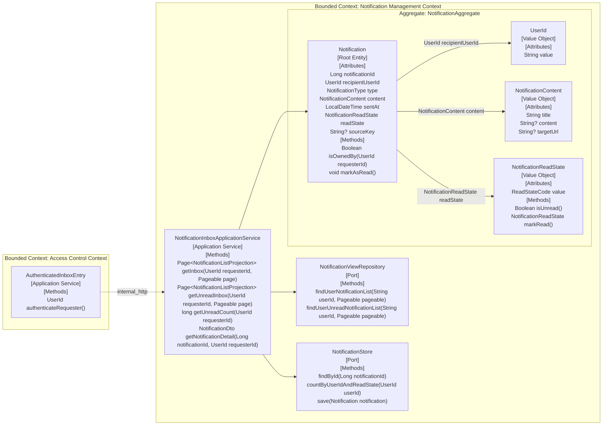

# UC-030 후보 DDD 설계

## Scope
- 대상 유스케이스: `UC-030. Notification Recipient views their Notification Inbox`
- 후보 경계: recipient-scoped inbox 조회, unread 조회, unread count, detail 조회 후 단건 read 전환에 필요한 후보 모델만 다룬다.
- 누적 상태: `entity_vo`, `behaviors`, `application_flow`, `aggregates`, `bounded_contexts`를 하나의 후보 문서와 하나의 Mermaid graph로 병합했다.

## Impact Assessment
| Element Type | Element | Status | Baseline Evidence | Event Storming Evidence |
|---|---|---|---|---|
| Entity | Notification | modify | `notification/src/main/java/org/codenbug/notification/domain/entity/Notification.java`가 `userId`, `NotificationContent`, `sentAt`, `isRead`, `status`, `sourceKey`를 가진 기존 persisted entity다. `NotificationQueryService`도 상세 조회 후 같은 entity를 저장한다. | `event-storming.md`의 목록, 미읽음 목록, 미읽음 개수, 상세 조회 흐름과 규칙 1-4가 모두 같은 `Notification` 생애주기를 전제로 한다. 특히 상세 성공 뒤 해당 건만 `Unread -> Read` 전환된다. |
| Value Object | UserId | reuse | `notification/src/main/java/org/codenbug/notification/domain/entity/UserId.java`가 기존 embeddable VO다. `NotificationQueryService`와 테스트가 unread count와 ownership 검증에 같은 타입을 사용한다. | `use-case.md`의 Goal, Observable Constraints, Failure Flow가 모두 `Recipient User ID` 범위 제한과 소유권 검증을 요구한다. |
| Value Object | NotificationContent | reuse | `notification/src/main/java/org/codenbug/notification/domain/entity/NotificationContent.java`가 `title`, `content`, `targetUrl` 묶음을 가진 기존 VO다. | `use-case.md` Main Flow 2, 4, 6과 Result는 목록과 상세 응답이 recipient에게 노출되는 알림 표현 데이터를 전제로 한다. |
| Value Object | NotificationReadState | new | baseline 구현은 `Notification.isRead` boolean과 unread query/count 메서드로 읽음 상태를 암묵 표현한다. 별도 값 타입은 없다. | `event-storming.md`의 `Unread Notification` 목록, `Unread Notification` 개수, `Notification` 상세 조회 흐름과 규칙 3-4가 `Unread`와 `Read`를 명시적 비즈니스 상태로 사용한다. |

## Entity / Value Objects
| Entity | Attributes / VOs | Status | Previous Definition | Proposed Definition | Evidence |
|---|---|---|---|---|---|
| Notification | `notificationId: Long` `recipientUserId: UserId` `type: NotificationType` `content: NotificationContent` `sentAt: LocalDateTime` `readState: NotificationReadState` `sourceKey: String?` | modify | baseline `Notification` entity는 persisted row identity, recipient ownership, content bundle, `sentAt`, `isRead`, `status`, `sourceKey`를 가진다. | recipient가 시간에 따라 조회하고 상태를 바꾸는 단일 알림 root로 유지한다. `Notification Inbox`는 별도 entity를 만들지 않고 `recipientUserId`, `sentAt`, `readState` 조건으로 파생되는 query view로 해석한다. `readState`는 후보 문서에서 명시적 VO로 승격한다. | `use-case.md` Main Flow 1-6, Failure Flow 2-3, Result; `event-storming.md` 목록, 미읽음, 상세 조회 전 흐름과 규칙 1-4; `e2e-goal.md` Business Success Criteria; baseline `Notification.java` |
| UserId | `value: String` | reuse | baseline `UserId` VO는 공백 사용자 ID를 거부하고 trim된 값을 동등성 기준으로 사용한다. | 인증된 요청자와 알림 소유자를 연결하는 값 타입으로 재사용한다. 상세 조회의 ownership 검증과 목록, 미읽음 조회의 recipient scope를 모두 이 값으로 표현한다. | `use-case.md` Goal, Observable Constraints; `event-storming.md` 규칙 1, 5와 상세 소유권 확인 흐름; baseline `UserId.java` |
| NotificationContent | `title: String` `content: String?` `targetUrl: String?` | reuse | baseline `NotificationContent` VO는 제목 필수, 내용 길이 검증, 링크 선택 입력을 수행한다. | inbox 목록과 상세 응답에 노출되는 표현 묶음으로 재사용한다. UC-030은 생성 규칙을 바꾸지 않고 recipient 조회 모델에서 같은 VO를 사용한다. | `use-case.md` Main Flow 2, 4, 6과 Result; `e2e-goal.md` Required user-visible evidence; baseline `NotificationContent.java` |
| NotificationReadState | `value: ReadStateCode` | new | baseline에는 별도 VO가 없고 `Notification.isRead`와 unread-specific query 메서드가 상태 의미를 나눠 가진다. | `Unread`와 `Read` 전이를 담당하는 값 타입으로 제안한다. unread list와 unread count는 `Unread`만 포함하고, 성공한 detail 반환 직후 해당 `Notification`만 `Read`로 전이한다. 값 집합은 `{UNREAD, READ}`다. | `use-case.md` Main Flow 3-6, Observable Constraints; `event-storming.md` `Unread Notification` 목록, `Unread Notification` 개수, `Notification` 상세 조회 흐름과 규칙 3-4; `e2e-goal.md` Business Success Criteria |

## Behaviors
| Owner / Service | Signature | Participants | Placement | Policy Evidence |
|---|---|---|---|---|
| Notification | `Boolean isOwnedBy(UserId requesterId)` | `Notification`, `UserId` | Entity | `use-case.md` Failure Flow 3과 `event-storming.md`의 `Notification` 소유권 확인, 소유권 불일치 거절 흐름이 상세 조회 전에 recipient ownership 검증을 요구한다. |
| Notification | `void markAsRead()` | `Notification`, `NotificationReadState` | Entity | `use-case.md` Main Flow 6과 `event-storming.md`의 `Notification` 상세 반환 후 `Unread`일 때만 `Read`로 변경 규칙이 조회 성공 뒤 단건 전이를 요구한다. |
| NotificationReadState | `Boolean isUnread()` | `NotificationReadState` | Value Object | `use-case.md` Main Flow 3-6과 `event-storming.md`의 unread 목록, unread count, detail 전환 흐름이 `Unread` 판정을 명시적으로 요구한다. |
| NotificationReadState | `NotificationReadState markRead()` | `NotificationReadState` | Value Object | `event-storming.md` 규칙 4와 `e2e-goal.md` Business Success Criteria가 성공한 detail 조회 직후 단일 알림만 `Read`로 전이해야 함을 요구한다. |

## Application Flow
| Application Service | Signature | Description | Calls | Evidence |
|---|---|---|---|---|
| NotificationInboxApplicationService | `Page<NotificationListProjection> getInbox(UserId requesterId, Pageable page)` | 인증된 requester identity를 입력으로 받아 recipient 범위 목록을 최신순 페이지로 조회하고 상태는 변경하지 않는다. | `NotificationViewRepository.findUserNotificationList` | `use-case.md` Main Flow 1-2; `event-storming.md` `Notification Inbox` 목록 조회 흐름; 규칙 2 |
| NotificationInboxApplicationService | `Page<NotificationListProjection> getUnreadInbox(UserId requesterId, Pageable page)` | 인증된 requester identity를 입력으로 받아 unread 상태 알림만 조회하고 상태는 변경하지 않는다. | `NotificationViewRepository.findUserUnreadNotificationList` | `use-case.md` Main Flow 3-4; `event-storming.md` `Unread Notification` 목록 조회 흐름; 규칙 3 |
| NotificationInboxApplicationService | `long getUnreadCount(UserId requesterId)` | 인증된 requester identity를 입력으로 받아 unread 상태 개수만 계산하고 상태는 변경하지 않는다. | `NotificationStore.countByUserIdAndReadState` | `use-case.md` Main Flow 3-4; `event-storming.md` `Unread Notification` 개수 조회 흐름; 규칙 3 |
| NotificationInboxApplicationService | `NotificationDto getNotificationDetail(Long notificationId, UserId requesterId)` | 대상 알림을 찾고 ownership을 확인한 뒤 상세를 반환한다. 반환 대상이 `Unread`면 같은 root만 `Read`로 전이하고 저장한다. | `NotificationStore.findById`, `Notification.isOwnedBy`, `NotificationReadState.isUnread`, `Notification.markAsRead`, `NotificationStore.save` | `use-case.md` Main Flow 5-6, Failure Flow 2-3; `event-storming.md` 상세 조회 성공, 미존재 거절, 소유권 불일치 거절 흐름; 규칙 4 |

## Aggregates
| Aggregate | Aggregate Root | Members | Atomic Invariant | Evidence |
|---|---|---|---|---|
| NotificationAggregate | Notification | `Notification` `UserId` `NotificationContent` `NotificationReadState` | recipient-scoped 조회는 항상 `recipientUserId` 범위 안에서만 수행된다. unread 목록과 unread count는 상태를 바꾸지 않는다. 성공한 detail 조회는 반환된 동일 root가 `Unread`일 때만 그 root 하나를 `Read`로 전이한다. | `use-case.md` Observable Constraints; `event-storming.md` 규칙 1-5; `e2e-goal.md` Business Success Criteria |

## Bounded Contexts
| Bounded Context | Owned Aggregates / Entities | Boundary Reason | Communication Type | Target BC | Evidence |
|---|---|---|---|---|---|
| Access Control Context | `AuthenticationDecision` | 인증 여부 판단은 `Gateway 인증 계층`에 있고 `Notification` 조회 규칙과 독립적으로 변경된다. | `internal_http` | `Notification Management Context` | `event-storming.md`의 모든 조회 진입이 `Gateway 인증 계층`에서 시작되고 인증 실패가 조회 시스템 진입 전에 거절된다. |
| Notification Management Context | `NotificationAggregate` | recipient scope, unread/read 전이, 목록과 상세 조회 규칙이 같은 `Notification` 언어와 상태 규칙으로 묶인다. | `internal_http` | `Access Control Context` | `event-storming.md`에서 인증 통과 뒤 `Notification 조회 시스템`이 목록, unread, detail, read 전환 규칙을 모두 수행한다. |

## Integration Impact
- `Notification`은 `UC-031` 삭제 흐름과 `UC-032` 생성 흐름이 공유하는 persisted shape를 계속 사용하므로 `sourceKey`, `NotificationContent`, ownership 규칙은 `ddd-design-integration`에서 shared Aggregate 후보와 대조돼야 한다.
- `NotificationReadState`는 이번 slice에서 새 VO 후보로 승격했지만 baseline 구현은 boolean `isRead`를 사용한다. 통합 단계에서 shared model 승격 여부와 기존 `NotificationStatus` 의미 분리를 함께 정리해야 한다.

## Architecture Visualization
<!-- harness:ddd-visualization:entity_vo:start -->

<!-- harness:ddd-visualization:entity_vo:end -->
