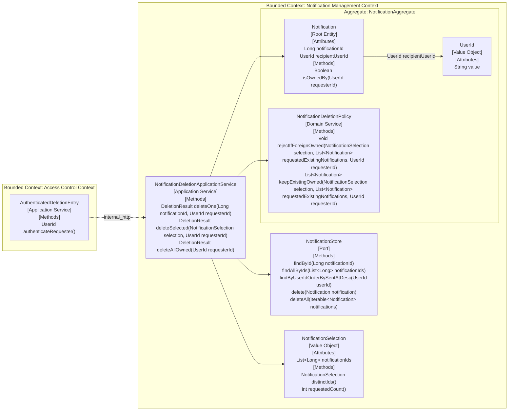

# UC-031 후보 DDD 설계

## Scope
- 대상 유스케이스: `UC-031. Notification Recipient deletes their Notifications`
- 후보 경계: 단건, `selected-set`, `all-owned` 범위 삭제와 ownership isolation 규칙을 만족하는 후보 모델만 다룬다.
- 누적 상태: `entity_vo`, `behaviors`, `application_flow`, `aggregates`, `bounded_contexts`를 하나의 후보 문서와 하나의 Mermaid graph로 통합했다.

## Impact Assessment
| Element Type | Element | Status | Baseline Evidence | Event Storming Evidence |
|---|---|---|---|---|
| Entity | Notification | modify | `notification/src/main/java/org/codenbug/notification/domain/entity/Notification.java`가 recipient ownership을 가진 persisted entity이고 `NotificationCommandService`가 삭제 대상 root로 사용한다. | `event-storming.md`의 단건, `selected-set`, `all-owned` 삭제 흐름과 규칙 1-6이 모두 요청자 소유 `Notification`만 삭제 대상으로 다룬다. |
| Value Object | UserId | reuse | `notification/src/main/java/org/codenbug/notification/domain/entity/UserId.java`가 기존 ownership 비교용 VO다. `NotificationCommandService`가 삭제 시 `new UserId(userId)`를 만든다. | `use-case.md` Goal, Observable Constraints와 `event-storming.md` 규칙 1, 3, 6이 모두 recipient ownership 범위를 강제한다. |
| Value Object | NotificationSelection | new | baseline 구현에는 `NotificationDeleteRequestDto.notificationIds: List<Long>` DTO만 있고 selected deletion의 후보 VO는 없다. | `event-storming.md`가 `selected-set` 삭제 대상 식별, 타인 소유 포함 여부 확인, 이미 없는 owned 제외를 별도 단계로 분리한다. |

## Entity / Value Objects
| Entity | Attributes / VOs | Status | Previous Definition | Proposed Definition | Evidence |
|---|---|---|---|---|---|
| Notification | `notificationId: Long` `recipientUserId: UserId` | modify | baseline `Notification` entity는 recipient ownership, content, read flag, delivery status, source key를 모두 가진 persisted root다. | 삭제 유스케이스에서는 owned 범위 판정과 삭제 실행의 기준이 되는 root로 유지한다. `Notification Inbox`는 별도 entity를 만들지 않고 삭제 대상 scope가 가리키는 `Notification` 집합으로 해석한다. | `use-case.md` Main Flow 1-4, Failure Flow 2-3; `event-storming.md` 단건, `selected-set`, `all-owned` 삭제 흐름과 규칙 1-6; baseline `Notification.java` |
| UserId | `value: String` | reuse | baseline `UserId` VO는 공백 사용자 ID를 거부하고 trim된 값을 사용한다. | 요청자 identity와 `Notification` ownership을 비교하는 값 타입으로 재사용한다. 모든 삭제 범위는 이 값으로 소유 여부를 검증한다. | `use-case.md` Goal, Observable Constraints; `event-storming.md` 단건 소유권 확인, `selected-set` 타인 소유 포함 여부 확인, 규칙 1-3; baseline `UserId.java` |
| NotificationSelection | `notificationIds: List<Long>` | new | baseline에는 삭제 요청 DTO의 `List<Long>`만 있고 distinct/non-empty selected set을 나타내는 후보 VO는 없다. | `selected-set` 삭제 요청의 명시적 값 타입으로 제안한다. 비어 있지 않은 ID 목록만 허용하고 중복 ID는 정규화해 하나의 선택 집합으로 다룬다. | `use-case.md` Preconditions, Main Flow 1, Observable Constraints; `event-storming.md` `selected-set` 삭제 흐름과 이미 없는 owned 무시 흐름; baseline `NotificationDeleteRequestDto.java` |

## Behaviors
| Owner / Service | Signature | Participants | Placement | Policy Evidence |
|---|---|---|---|---|
| Notification | `Boolean isOwnedBy(UserId requesterId)` | `Notification`, `UserId` | Entity | `use-case.md` Failure Flow 2와 `event-storming.md`의 단건 소유권 확인, 소유권 불일치 거절 흐름이 삭제 전에 ownership 판정을 요구한다. |
| NotificationSelection | `NotificationSelection distinctIds()` | `NotificationSelection` | Value Object | `event-storming.md`의 `selected-set` 삭제 대상 식별 단계가 중복 없는 명시적 선택 집합을 전제로 한다. |
| NotificationSelection | `int requestedCount()` | `NotificationSelection` | Value Object | `event-storming.md`의 이미 없는 owned 제외, 남아 있는 기존 owned 여부 판단이 선택 집합 크기와 비교 가능한 값을 요구한다. |
| NotificationDeletionPolicy | `void rejectIfForeignOwned(NotificationSelection selection, List<Notification> requestedExistingNotifications, UserId requesterId)` | `NotificationSelection`, `Notification`, `UserId` | Domain Service | `use-case.md` Failure Flow 2와 `event-storming.md`의 `selected-set` 타인 소유 포함 시 전체 거절 규칙이 단일 entity 밖의 집합 정책을 요구한다. |
| NotificationDeletionPolicy | `List<Notification> keepExistingOwned(NotificationSelection selection, List<Notification> requestedExistingNotifications, UserId requesterId)` | `NotificationSelection`, `Notification`, `UserId` | Domain Service | `event-storming.md`의 이미 없는 owned 제외, 남아 있는 기존 owned만 삭제, 0건이어도 정상 결과 반환 규칙이 집합 정제 정책을 요구한다. |

## Application Flow
| Application Service | Signature | Description | Calls | Evidence |
|---|---|---|---|---|
| NotificationDeletionApplicationService | `DeletionResult deleteOne(Long notificationId, UserId requesterId)` | 대상 알림을 식별하고 ownership을 확인한 뒤 해당 root 하나만 삭제하고 결과를 반환한다. | `NotificationStore.findById`, `Notification.isOwnedBy`, `NotificationStore.delete` | `use-case.md` Main Flow 1-4; `event-storming.md` 단건 삭제 성공과 소유권 불일치 거절 흐름 |
| NotificationDeletionApplicationService | `DeletionResult deleteSelected(NotificationSelection selection, UserId requesterId)` | 요청된 선택 집합의 existing 대상을 읽고 foreign-owned 포함 여부를 거절 규칙으로 검사한 뒤 existing owned만 남겨 삭제하고 결과를 반환한다. | `NotificationStore.findAllByIds`, `NotificationDeletionPolicy.rejectIfForeignOwned`, `NotificationDeletionPolicy.keepExistingOwned`, `NotificationStore.deleteAll` | `use-case.md` Main Flow 1-4, Failure Flow 3; `event-storming.md` `selected-set` 삭제, 이미 없는 owned 무시, foreign-owned 거절, 0건 정상 종료 흐름 |
| NotificationDeletionApplicationService | `DeletionResult deleteAllOwned(UserId requesterId)` | 요청자 owned 전체 범위를 확정하고 그 범위 안의 모든 `Notification`을 삭제한 뒤 결과를 반환한다. | `NotificationStore.findByUserIdOrderBySentAtDesc`, `NotificationStore.deleteAll` | `use-case.md` Main Flow 1-4; `event-storming.md` `all-owned` 삭제 흐름; 규칙 6 |

## Aggregates
| Aggregate | Aggregate Root | Members | Atomic Invariant | Evidence |
|---|---|---|---|---|
| NotificationAggregate | Notification | `Notification` `UserId` `NotificationDeletionPolicy` | 삭제는 항상 승인된 requester ownership 범위 안에서만 수행된다. 단건과 `selected-set` 삭제는 foreign-owned `Notification`이 하나라도 포함되면 거절된다. `selected-set` 삭제는 이미 없는 owned `Notification`을 실패 사유로 만들지 않고 남아 있는 existing owned만 삭제한다. | `use-case.md` Observable Constraints; `event-storming.md` 규칙 1-6; `e2e-goal.md` Business Success Criteria와 Business Failure Criteria |

## Bounded Contexts
| Bounded Context | Owned Aggregates / Entities | Boundary Reason | Communication Type | Target BC | Evidence |
|---|---|---|---|---|---|
| Access Control Context | `AuthenticationDecision` | 삭제 요청의 인증 판정은 `Gateway 인증 계층`이 맡고 삭제 집합 규칙과 독립적으로 바뀐다. | `internal_http` | `Notification Management Context` | `event-storming.md`의 모든 삭제 진입이 `Gateway 인증 계층`에서 시작하고 비인증 요청이 삭제 시스템 진입 전에 거절된다. |
| Notification Management Context | `NotificationAggregate` | ownership isolation, `selected-set` 정제, `all-owned` 범위 삭제 규칙이 같은 `Notification` 언어와 삭제 정책으로 묶인다. | `internal_http` | `Access Control Context` | `event-storming.md`의 `Notification 삭제 시스템`이 단건, `selected-set`, `all-owned` 삭제와 foreign-owned 거절 규칙을 모두 수행한다. |

## Integration Impact
- `Notification` root는 `UC-030` 조회/읽음 전이, `UC-032` 생성과 공유되므로 삭제 유스케이스에서 축약한 속성 표현과 shared persisted shape의 정합성은 `ddd-design-integration`에서 재조정해야 한다.
- `NotificationSelection`은 이번 slice의 새 후보 VO다. baseline 구현은 boundary DTO `NotificationDeleteRequestDto`만 가지므로 통합 단계에서 request DTO와 domain VO 경계, 그리고 foreign-owned 판정에 필요한 store contract를 함께 정리해야 한다.

## Architecture Visualization
<!-- harness:ddd-visualization:entity_vo:start -->

<!-- harness:ddd-visualization:entity_vo:end -->
