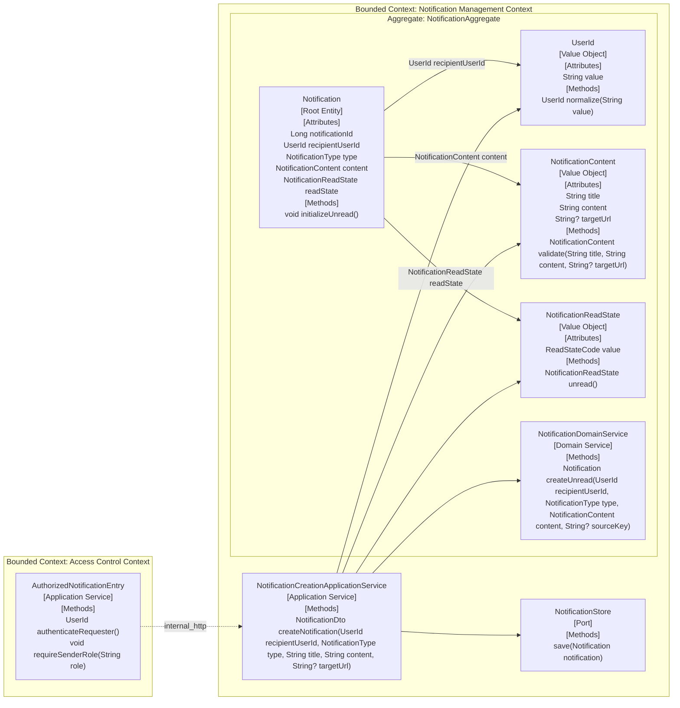

# UC-032 후보 DDD 설계

## Scope
- 대상 유스케이스: `UC-032. Notification Sender creates a Notification for a Notification Recipient`
- 후보 경계: 권한 검증을 통과한 생성 요청이 지정한 recipient에 대해 unread `Notification` 1건을 만들고 inbox에서 조회 가능하게 만드는 후보 모델만 다룬다.
- 누적 상태: `entity_vo`, `behaviors`, `application_flow`, `aggregates`, `bounded_contexts`를 하나의 후보 문서와 하나의 Mermaid graph로 통합했다.

## Impact Assessment
| Element Type | Element | Status | Baseline Evidence | Event Storming Evidence |
|---|---|---|---|---|
| Entity | Notification | modify | `notification/src/main/java/org/codenbug/notification/domain/entity/Notification.java`가 recipient, type, content, unread flag, delivery status를 가진 persisted root이고 `NotificationCommandService.createNotification`이 생성에 사용한다. | `event-storming.md`의 생성 성공 흐름과 규칙 2-5가 지정 recipient에 대해 `Unread Notification` 1건을 저장하고 inbox에서 조회 가능하게 해야 함을 요구한다. |
| Value Object | UserId | reuse | `notification/src/main/java/org/codenbug/notification/domain/entity/UserId.java`가 기존 recipient 식별 VO다. `NotificationDomainService.createNotification`이 생성 시 같은 VO를 만든다. | `use-case.md` Preconditions, Observable Constraints와 `event-storming.md`의 `Recipient User ID` 검증 단계가 빈 recipient ID를 허용하지 않는다. |
| Value Object | NotificationContent | reuse | `notification/src/main/java/org/codenbug/notification/domain/entity/NotificationContent.java`가 `title`, `content`, `targetUrl`를 묶고 제목/내용 검증을 수행한다. | `use-case.md` Preconditions와 `event-storming.md`의 필수 입력 검증 단계가 `title`, `content`, optional `target URL`을 같은 payload로 다룬다. |
| Value Object | NotificationReadState | reuse | `docs/use-cases/UC-030/ddd-design.md`가 `Unread`와 `Read`를 구분하는 후보 VO로 이미 제안했고 baseline 구현은 `Notification.isRead` boolean을 사용한다. | `use-case.md` Main Flow 3과 `event-storming.md`의 `Unread Notification` 1건 저장 규칙이 생성 직후 초기 상태를 `Unread`로 고정한다. |

## Entity / Value Objects
| Entity | Attributes / VOs | Status | Previous Definition | Proposed Definition | Evidence |
|---|---|---|---|---|---|
| Notification | `notificationId: Long` `recipientUserId: UserId` `type: NotificationType` `content: NotificationContent` `readState: NotificationReadState` | modify | baseline `Notification` entity는 `userId`, `type`, `notificationContent`, `isRead`, `status`, `sourceKey`, `sentAt`를 가진 persisted root다. | 생성 유스케이스에서는 지정 recipient에 귀속된 unread root로 정의한다. valid request는 정확히 1건만 만들고 `readState`는 항상 `UNREAD`로 시작한다. `target URL`은 `NotificationContent` 내부 선택 속성으로 유지한다. | `use-case.md` Main Flow 1-4, Failure Flow 1-3, Observable Constraints; `event-storming.md` 생성 성공, 권한 부족 거절, 입력 검증 실패 거절 흐름; `e2e-goal.md` Business Success Criteria; baseline `Notification.java` |
| UserId | `value: String` | reuse | baseline `UserId` VO는 공백 문자열을 거부하고 trim된 값으로 정규화한다. | 생성 대상 recipient identity를 나타내는 값 타입으로 재사용한다. 빈 `Recipient User ID`는 생성 전에 거절된다. | `use-case.md` Preconditions와 Failure Flow 3; `event-storming.md` `Recipient User ID` 검증 단계; baseline `UserId.java` |
| NotificationContent | `title: String` `content: String` `targetUrl: String?` | reuse | baseline `NotificationContent` VO는 제목 필수, 내용 길이 검증, target URL 선택 입력을 처리한다. | 생성 요청의 필수 payload를 담는 값 타입으로 재사용한다. `title`과 `content`는 필수이고 `targetUrl`만 선택이다. | `use-case.md` Preconditions와 Observable Constraints; `event-storming.md` 필수 입력 검증 단계; baseline `NotificationContent.java` |
| NotificationReadState | `value: ReadStateCode` | reuse | `docs/use-cases/UC-030/ddd-design.md`는 `{UNREAD, READ}` 후보 VO를 제안했고 baseline 구현은 `isRead` boolean으로 초기 unread를 표현한다. | 생성 직후 초기 상태를 `UNREAD`로 고정하는 값 타입으로 재사용한다. UC-032는 생성 시 `READ` 초기값을 허용하지 않는다. | `use-case.md` Goal, Main Flow 3, Observable Constraints; `event-storming.md` `Unread Notification` 1건 저장 흐름과 규칙 2; `e2e-goal.md` Business Success Criteria |

## Behaviors
| Owner / Service | Signature | Participants | Placement | Policy Evidence |
|---|---|---|---|---|
| UserId | `UserId normalize(String value)` | `UserId` | Value Object | `use-case.md` Failure Flow 3과 `event-storming.md`의 빈 `Recipient User ID` 거절 규칙이 recipient identifier validation을 요구한다. |
| NotificationContent | `NotificationContent validate(String title, String content, String? targetUrl)` | `NotificationContent` | Value Object | `use-case.md` Preconditions와 Failure Flow 3, `event-storming.md`의 필수 입력 검증 단계가 제목과 내용의 필수성, target URL의 선택성을 요구한다. |
| NotificationReadState | `NotificationReadState unread()` | `NotificationReadState` | Value Object | `use-case.md` Main Flow 3과 `event-storming.md`의 `Unread Notification` 1건 저장 규칙이 생성 직후 초기 상태를 `Unread`로 고정한다. |
| NotificationDomainService | `Notification createUnread(UserId recipientUserId, NotificationType type, NotificationContent content, String? sourceKey)` | `Notification`, `UserId`, `NotificationContent`, `NotificationReadState` | Domain Service | `event-storming.md`의 valid request 저장 규칙과 `e2e-goal.md` Business Success Criteria가 정확히 1건의 unread root를 구성해야 함을 요구한다. |

## Application Flow
| Application Service | Signature | Description | Calls | Evidence |
|---|---|---|---|---|
| NotificationCreationApplicationService | `NotificationDto createNotification(UserId recipientUserId, NotificationType type, String title, String content, String? targetUrl)` | upstream `Access Control Context`가 인증과 역할 검증을 통과시킨 뒤 recipient ID와 필수 payload를 VO로 정규화하고 unread root 1건을 생성해 저장한 후 결과를 반환한다. | `UserId.normalize`, `NotificationContent.validate`, `NotificationReadState.unread`, `NotificationDomainService.createUnread`, `NotificationStore.save` | `use-case.md` Main Flow 1-4, Failure Flow 1-3; `event-storming.md` 권한 확인, 입력 검증, unread 저장, inbox 조회 가능, 결과 반환 흐름 |

## Aggregates
| Aggregate | Aggregate Root | Members | Atomic Invariant | Evidence |
|---|---|---|---|---|
| NotificationAggregate | Notification | `Notification` `UserId` `NotificationContent` `NotificationReadState` `NotificationDomainService` | valid create request는 지정 recipient에 대해 정확히 하나의 unread `Notification`만 저장한다. blank `Recipient User ID` 또는 필수 입력 누락 요청은 root를 저장하지 않는다. 권한 검증은 aggregate 바깥 `Access Control Context`에서 선행돼야 한다. | `use-case.md` Preconditions, Observable Constraints; `event-storming.md` 규칙 1-5; `e2e-goal.md` Business Success Criteria와 Business Failure Criteria |

## Bounded Contexts
| Bounded Context | Owned Aggregates / Entities | Boundary Reason | Communication Type | Target BC | Evidence |
|---|---|---|---|---|---|
| Access Control Context | `AuthorizationDecision` | 인증과 `ADMIN` 또는 `MANAGER` 역할 판정은 `Gateway 인증 계층`에서 수행되고 `Notification` 생성 규칙과 독립적으로 변경된다. | `internal_http` | `Notification Management Context` | `event-storming.md`가 인증 통과 후 권한 확인을 거쳐야만 `Notification 생성 시스템`으로 진입한다고 명시한다. |
| Notification Management Context | `NotificationAggregate` | recipient validation, payload validation, unread 초기화, inbox 가시성 보장이 같은 `Notification` 생성 언어와 규칙으로 묶인다. | `internal_http` | `Access Control Context` | `event-storming.md`의 `Notification 생성 시스템`이 입력 검증, unread 저장, inbox 조회 가능화, 결과 반환을 한 경계에서 수행한다. |

## Integration Impact
- `NotificationAggregate`는 `UC-030` 조회/읽음 전이, `UC-031` 삭제와 공유된다. 생성 유스케이스에서 생략한 `status`, `sourceKey`, `sentAt` 등 baseline persisted 속성의 shared 의미는 `ddd-design-integration`에서 합쳐야 한다.
- `NotificationReadState`는 `UC-030` 후보를 재사용했다. baseline boolean `isRead`를 shared VO로 승격할지, 그리고 delivery `NotificationStatus`와 어떻게 분리할지는 통합 단계에서 정리돼야 한다.

## Architecture Visualization
<!-- harness:ddd-visualization:entity_vo:start -->

<!-- harness:ddd-visualization:entity_vo:end -->
