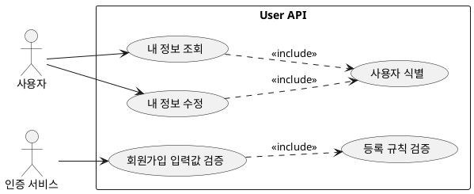

# User Module API 문서

- 대상: `user` 모듈의 모든 엔드포인트
- 기준: 코드 기준 동작/정책/제약사항을 정리

## 목차
- [유저 스토리](#유저-스토리)
- [유스케이스](#유스케이스)
- [정책과 제약사항](#정책과-제약사항)
- [엔드포인트 상세](#엔드포인트-상세)

## 유저 스토리
- 사용자는 내 정보를 조회/수정하고 싶다.
- 인증 서비스는 사용자 등록 정보를 사전 검증하고 싶다.

## 유스케이스

## 유스케이스 다이어그램

## 유스케이스 기반 이벤트 도출
| 유스케이스 | 이벤트 후보 | 목적 | 사용 여부 | 비고 |
| --- | --- | --- | --- | --- |
| 내 정보 수정 | UserProfileUpdated | 다른 서비스의 프로필 캐시/검색 색인 갱신 | 미사용(후보) | 사용자 어그리거트 밖 처리 |
| 회원가입 입력값 사전 검증 | 없음 | 검증 결과는 동기 응답으로 충분 | 해당 없음 | 외부 연계 불필요 |
| 내 정보 조회 | 없음 | 조회만으로는 부가기능 연계 없음 | 해당 없음 | - |

- 내 정보 조회
- 내 정보 수정
- 회원가입 입력값 사전 검증 (내부 호출)

## 정책과 제약사항
- 내 정보 조회/수정은 인증 필요 (`@AuthNeeded`).
- 역할 제한: 조회는 USER 또는 MANAGER, 수정은 USER만 가능.
- 내부 검증 API는 인증이 없다.

## 엔드포인트 상세
- GET `/api/v1/users/me`
  - 목적: 내 정보 조회
  - 인증: 필요 (`@AuthNeeded`)
  - 권한: `Role.USER`, `Role.MANAGER`
  - 응답: `RsData<UserInfo>`

- PUT `/api/v1/users/me`
  - 목적: 내 정보 수정
  - 인증: 필요 (`@AuthNeeded`)
  - 권한: `Role.USER`
  - 요청 바디: `UpdateUserRequest` (name, age, location, phoneNum)
  - 응답: `RsData<UserInfo>`

- POST `/internal/users/validate`
  - 목적: 회원가입 입력값 검증
  - 인증: 없음
  - 요청 바디: `RegisterValidationRequest` (name, age, sex, phoneNum, location)
  - 응답: `RsData<Void>`

## 추가 문서
- [facade.md](facade.md)
- [transaction.md](transaction.md)
