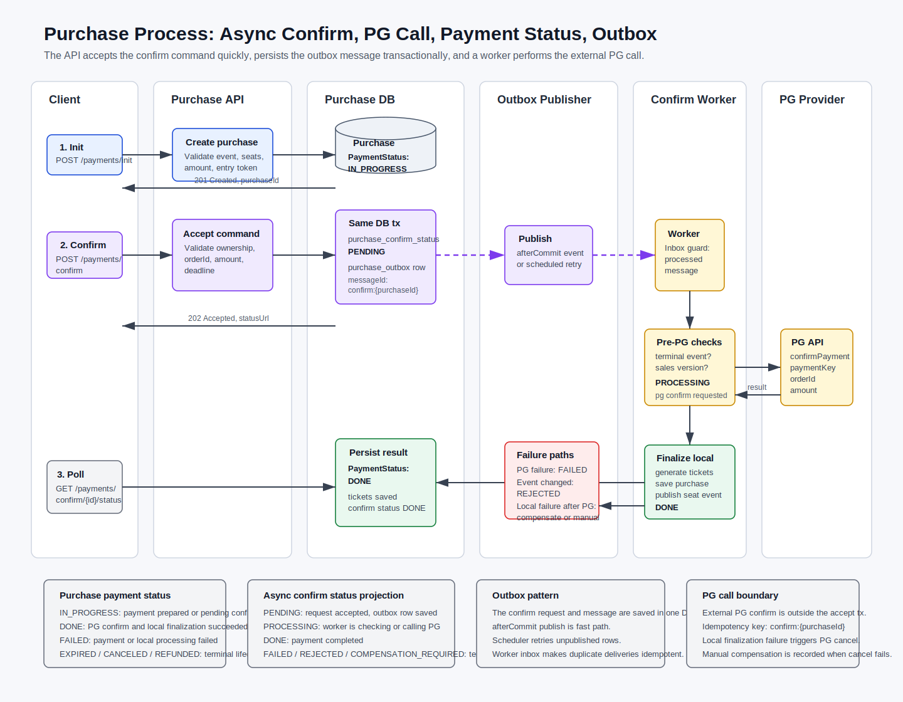

# 구매 서비스

구매 서비스는 도메인 주도 설계(DDD) 원칙에 따라 결제 처리, 티켓 생성 및 구매 관리를 담당합니다. 외부 결제 게이트웨이와 통합되며 전체 구매 라이프사이클을 관리합니다.

## 🎯 목적

* **결제 처리(Payment Processing)**: Toss Payments API 통합
* **티켓 관리(Ticket Management)**: 디지털 티켓 생성 및 라이프사이클 관리
* **구매 오케스트레이션(Purchase Orchestration)**: 전체 구매 흐름 조율
* **도메인 로직(Domain Logic)**: 비즈니스 불변식을 가진 풍부한 도메인 모델

## 🏗️ 아키텍처

### 서비스 아키텍처 다이어그램


### 도메인 모델 다이어그램

```mermaid
classDiagram
    class Purchase {
        +PurchaseId purchaseId
        +String orderId
        +String orderName
        +String eventId
        +String pid
        +int amount
        +PaymentMethod paymentMethod
        +PaymentStatus paymentStatus
        +LocalDateTime createdAt
        +UserId userId
        +List~Ticket~ tickets
        
        +validate(orderId, amount, userId)
        +updatePaymentInfo(...)
        +addTicket(ticket)
        +addTickets(tickets)
        +markAsCompleted()
        +isPaymentInProgress()
        +isPaymentCompleted()
    }
    
    class Ticket {
        +TicketId id
        +String location
        +LocalDateTime purchaseDate
        +EventId eventId
        +String seatId
        +Purchase purchase
        
        +assignToPurchase(purchase)
    }
    
    class PurchaseId {
        +String value
    }
    
    class UserId {
        +String value
    }
    
    class EventId {
        +String value
    }
    
    class TicketId {
        +String value
    }
    
    class PaymentMethod {
        <<enumeration>>
        CARD
        VIRTUAL_ACCOUNT
        MOBILE_PHONE
        +from(String method)
    }
    
    class PaymentStatus {
        <<enumeration>>
        IN_PROGRESS
        DONE
        EXPIRED
        CANCELLED
    }

    Purchase ||--o{ Ticket : contains
    Purchase *-- PurchaseId : has
    Purchase *-- UserId : has
    Ticket *-- TicketId : has
    Ticket *-- EventId : has
    Purchase -- PaymentMethod : uses
    Purchase -- PaymentStatus : has
```

## 🔄 데이터 흐름

### Asynchronous purchase confirm process



See [Purchase Process](../docs/purchase/purchase-process.md) for the async confirm flow, PG API boundary, payment status meanings, and outbox retry/idempotency behavior.

### 구매 흐름 시퀀스

```sequence
title: 구매 처리 흐름

Client->Controller: POST /purchase/initiate
Controller->PurchaseService: initiatePayment(request, userId)
PurchaseService->PaymentValidation: validatePaymentRequest(eventId, amount)
PaymentValidation->Database: 이벤트 존재 확인
PaymentValidation-->PurchaseService: 검증 결과

PurchaseService->Database: 새로운 Purchase 저장(IN_PROGRESS)
PurchaseService-->Client: InitiatePaymentResponse(purchaseId)

note over Client,Database: 결제 확인
Client->Controller: POST /purchase/confirm
Controller->PurchaseService: confirmPayment(request, userId)
PurchaseService->Database: ID로 Purchase 조회
PurchaseService->PurchaseService: purchase.validate(orderId, amount, userId)

PurchaseService->TossAPI: confirmPayment(paymentKey, orderId, amount)
TossAPI-->PurchaseService: ConfirmedPaymentInfo

PurchaseService->PurchaseDomain: confirmPurchase(purchase, paymentInfo, userId)

note over PurchaseDomain,Database: 도메인 처리
PurchaseDomain->Redis: getLockedSeatIdsByUserId(userId)
PurchaseDomain->PaymentValidation: validateSeatSelection(eventId, seatIds)
PurchaseDomain->TicketGeneration: generateTickets(purchase, seatIds, ...)
PurchaseDomain->PurchaseDomain: purchase.updatePaymentInfo(...)
PurchaseDomain-->PurchaseService: PurchaseConfirmationResult

PurchaseService->PurchaseService: purchase.markAsCompleted()
PurchaseService->Database: 티켓 및 Purchase 저장
PurchaseService->Database: 좌석 구매 이벤트 발행
PurchaseService-->Client: ConfirmPaymentResponse
```

## 🛠️ API 엔드포인트

### 결제 관리

#### 결제 시작

```http
POST /api/v1/purchase/initiate
Content-Type: application/json
Authorization: Bearer {JWT_TOKEN}

{
  "eventId": "event123",
  "orderId": "order_20250122_001",
  "amount": 50000
}
```

**응답:**

```json
{
  "purchaseId": "purchase_uuid",
  "paymentStatus": "IN_PROGRESS"
}
```

#### 결제 확인

```http
POST /api/v1/purchase/confirm  
Content-Type: application/json
Authorization: Bearer {JWT_TOKEN}

{
  "purchaseId": "purchase_uuid",
  "paymentKey": "payment_key_from_toss",
  "orderId": "order_20250122_001", 
  "amount": 50000
}
```

**응답:**

```json
{
  "paymentKey": "payment_key_from_toss",
  "orderId": "order_20250122_001",
  "orderName": "지정석 2매",
  "totalAmount": 50000,
  "status": "DONE",
  "method": "CARD",
  "approvedAt": "2025-01-22T10:30:00",
  "receipt": {
    "url": "https://..."
  }
}
```

### 구매 내역

#### 구매 내역 목록 조회

```http
GET /api/v1/purchase/history?page=0&size=10
Authorization: Bearer {JWT_TOKEN}
```

**응답:**

```json
{
  "purchases": [
    {
      "purchaseId": "purchase_uuid",
      "orderName": "지정석 2매",
      "amount": 50000,
      "paymentMethod": "CARD",
      "createdAt": "2025-01-22T10:30:00",
      "paymentStatus": "DONE"
    }
  ],
  "totalElements": 15,
  "totalPages": 2,
  "currentPage": 0
}
```

#### 구매 내역 상세 조회

```http
GET /api/v1/purchase/history/{purchaseId}
Authorization: Bearer {JWT_TOKEN}
```

**응답:**

```json
{
  "purchases": [
    {
      "purchaseId": "purchase_uuid",
      "paymentKey": "payment_key",
      "orderName": "지정석 2매", 
      "amount": 50000,
      "paymentMethod": "CARD",
      "paymentStatus": "DONE",
      "createdAt": "2025-01-22T10:30:00",
      "tickets": [
        {
          "ticketId": "ticket_uuid1",
          "eventId": "event123",
          "seatId": "A1",
          "location": "Main Hall"
        },
        {
          "ticketId": "ticket_uuid2", 
          "eventId": "event123",
          "seatId": "A2",
          "location": "Main Hall"
        }
      ]
    }
  ]
}
```

### 결제 취소

#### 결제 취소

```http
POST /api/v1/purchase/{paymentKey}/cancel
Content-Type: application/json
Authorization: Bearer {JWT_TOKEN}

{
  "cancelReason": "Customer requested cancellation"
}
```

**응답:**

```json
{
  "paymentKey": "payment_key",
  "orderId": "order_20250122_001",
  "status": "CANCELED",
  "canceledAmount": 50000,
  "cancelReason": "Customer requested cancellation",
  "canceledAt": "2025-01-22T11:00:00"
}
```

## 🗂️ 도메인 구조

### 애그리게이트

#### Purchase 애그리게이트

Purchase 애그리게이트는 전체 구매 라이프사이클을 관리하는 루트 엔터티입니다:

**책임:**

* 결제 상태 관리
* 티켓 컬렉션 관리
* 비즈니스 규칙 강제
* 상태 전이

**핵심 메서드:**

```java
// 검증
public void validate(String orderId, Integer amount, String userId)

// 결제 정보 업데이트
public void updatePaymentInfo(String paymentUuid, String eventId, int amount, 
                             PaymentMethod paymentMethod, String purchaseName, 
                             LocalDateTime createdDate)

// 상태 관리
public void markAsCompleted()
public boolean isPaymentInProgress()
public boolean isPaymentCompleted()

// 티켓 관리
public void addTicket(Ticket ticket)
public void addTickets(List<Ticket> tickets)
```

**비즈니스 불변식:**

* Purchase는 유효한 주문 ID와 금액을 가져야 합니다
* 권한이 있는 사용자만 Purchase 데이터에 접근할 수 있습니다
* 결제 상태 전이는 유효해야 합니다
* 티켓은 유효한 Purchase에만 추가될 수 있습니다

#### Ticket 엔터티

Purchase 내 개별 티켓을 나타냅니다:

**책임:**

* 좌석 및 이벤트 연관
* Purchase 관계 관리
* 티켓 식별

```java
public class Ticket {
    // ...
    public void assignToPurchase(Purchase purchase) { /* ... */ }
}
```

### 값 객체

#### PurchaseId, UserId, EventId, TicketId

```java
@Embeddable
@Getter
public class PurchaseId {
    @Column(name = "purchase_id")
    private String value;
    
    protected PurchaseId() {}
    
    public PurchaseId(String value) {
        this.value = Objects.requireNonNull(value);
    }
}
```

### 도메인 서비스

#### PaymentValidationService

**책임:**

* 결제 요청 검증
* 이벤트 존재 여부 검증
* 좌석 선택 검증
* 이벤트 및 좌석 서비스 통합

**핵심 메서드:**

```java
void validatePaymentRequest(String eventId, int amount)
void validateSeatSelection(String eventId, List<String> seatIds)
EventSummary getEventSummary(String eventId)
SeatLayoutInfo getSeatLayout(Long seatLayoutId)
```

#### TicketGenerationService

**책임:**

* 티켓 생성 로직
* 주문 이름 생성
* 비즈니스 규칙 적용

**핵심 메서드:**

```java
List<Ticket> generateTickets(Purchase purchase, List<String> seatIds, 
                            EventSummary eventSummary, 
                            SeatLayoutInfo seatLayout)
String generateOrderName(EventSummary eventSummary, int seatCount)
```

#### PurchaseDomainService

**책임:**

* 복합 구매 워크플로우
* 애그리게이트 간 조정
* 트랜잭션 경계 관리

**핵심 메서드:**

```java
PurchaseConfirmationResult confirmPurchase(Purchase purchase, 
                                         ConfirmedPaymentInfo paymentInfo, 
                                         String userId)
```

### 리포지토리 인터페이스

#### PurchaseRepository

```java
public interface PurchaseRepository extends JpaRepository<Purchase, PurchaseId> {
    Optional<Purchase> findByPid(String paymentKey);
    Page<Purchase> findByUserIdAndPaymentStatusInOrderByCreatedAtDesc(
        UserId userId, List<PaymentStatus> statuses, Pageable pageable);
}
```

#### TicketRepository

```java
public interface TicketRepository extends JpaRepository<Ticket, TicketId> {
    List<Ticket> findByPurchase(Purchase purchase);
    List<Ticket> findByEventId(EventId eventId);
}
```

### 서비스 연동 인터페이스

#### EventInfoProvider

```java
public interface EventInfoProvider {
    EventSummary getEventSummary(String eventId);
}
```

#### SeatLayoutProvider

```java
public interface SeatLayoutProvider {
    SeatLayoutInfo getSeatLayout(Long seatLayoutId);
}
```

## 💳 결제 통합

### Toss Payments 통합

#### TossPaymentPgApiService

```java
@Component
public class TossPaymentPgApiService implements PGApiService {
    
    @Override
    public ConfirmedPaymentInfo confirmPayment(String paymentKey, String orderId, Integer amount) {
        String url = tossApiUrl + "/confirm";
        Map<String, Object> body = Map.of(
            "paymentKey", paymentKey,
            "orderId", orderId, 
            "amount", amount
        );
        return postToToss(url, body, ConfirmedPaymentInfo.class);
    }
    
    @Override 
    public CanceledPaymentInfo cancelPayment(String paymentKey, String cancelReason) {
        String url = tossApiUrl + "/" + paymentKey + "/cancel";
        Map<String, Object> body = Map.of("cancelReason", cancelReason);
        return postToToss(url, body, CanceledPaymentInfo.class);
    }
}
```

#### 인증 헤더

```java
private HttpHeaders createAuthHeaders() {
    HttpHeaders headers = new HttpHeaders();
    String encoded = Base64.getEncoder().encodeToString((secretKey + ":").getBytes());
    headers.set("Authorization", "Basic " + encoded);
    headers.setContentType(MediaType.APPLICATION_JSON);
    headers.setAcceptCharset(Collections.singletonList(StandardCharsets.UTF_8));
    return headers;
}
```

#### 한국어 문자 처리

```java
private <T> T postToToss(String url, Map<String, Object> body, Class<T> clazz) {
    try {
        HttpEntity<Map<String, Object>> request = new HttpEntity<>(body, createAuthHeaders());
        ResponseEntity<byte[]> response = restTemplate.exchange(url, HttpMethod.POST, request, byte[].class);
        
        String responseBody = new String(response.getBody(), StandardCharsets.UTF_8);
        ObjectMapper objectMapper = new ObjectMapper();
        
        return objectMapper.readValue(responseBody, clazz);
    } catch (Exception e) {
        throw new RuntimeException("Toss 응답 파싱 실패: " + e.getMessage(), e);
    }
}
```

## ⚙️ 구성

### 애플리케이션 설정

```yaml
server:
  port: 9003

spring:
  application:
    name: purchase
  datasource:
    url: jdbc:mysql://localhost:3306/ticketon_purchase
    username: ${DB_USERNAME:root}
    password: ${DB_PASSWORD:password}
  jpa:
    hibernate:
      ddl-auto: update
    show-sql: false
    properties:
      hibernate:
        format_sql: true
        
payment:
  toss:
    api-url: https://api.tosspayments.com/v1/payments
    secret-key: ${TOSS_SECRET_KEY}
    
redis:
  host: localhost
  port: 6379

rabbitmq:
  host: localhost
  port: 5672
  username: root
  password: root
```

### 데이터베이스 구성

```java
@Configuration
@EnableJpaAuditing
public class JpaConfig {
    
    @Bean
    public AuditorAware<String> auditorProvider() {
        return new SpringSecurityAuditorAware();
    }
}
```

## 🧪 테스트

### 단위 테스트

```java
@ExtendWith(MockitoExtension.class)
class PurchaseServiceTest {
    
    @Mock
    private PurchaseRepository purchaseRepository;
    
    @Mock
    private PaymentValidationService paymentValidationService;
    
    @Mock
    private PGApiService pgApiService;
    
    @InjectMocks
    private PurchaseService purchaseService;
    
    @Test
    void initiatePayment_ShouldCreatePurchase_WhenValidRequest() {
        // Given
        InitiatePaymentRequest request = new InitiatePaymentRequest("event123", "order123", 50000);
        String userId = "user123";
        
        // When
        InitiatePaymentResponse response = purchaseService.initiatePayment(request, userId);
        
        // Then
        assertThat(response.getPaymentStatus()).isEqualTo("IN_PROGRESS");
        verify(purchaseRepository).save(any(Purchase.class));
    }
}
```

### 통합 테스트

```java
@SpringBootTest
@Transactional
class PurchaseIntegrationTest {
    
    @Autowired
    private PurchaseService purchaseService;
    
    @MockBean
    private PGApiService pgApiService;
    
    @Test
    void confirmPayment_ShouldCompleteFlow_WhenValidData() {
        // Given: 테스트 데이터 설정
        // When: 결제 확인 실행
        // Then: 전체 흐름 검증
    }
}
```

## 📊 모니터링

### 헬스 체크

```http
GET /actuator/health
GET /actuator/metrics
GET /actuator/prometheus
```

### 커스텀 메트릭

```java
@Component
public class PurchaseMetrics {
    
    private final Counter purchaseCounter;
    private final Timer paymentTimer;
    
    public PurchaseMetrics(MeterRegistry meterRegistry) {
        this.purchaseCounter = Counter.builder("purchase.completed.total")
            .description("Total completed purchases")
            .register(meterRegistry);
            
        this.paymentTimer = Timer.builder("purchase.payment.duration")
            .description("Payment processing duration") 
            .register(meterRegistry);
    }
}
```

### 로깅 구성

```yaml
logging:
  level:
    org.codenbug.purchase: INFO
    org.springframework.transaction: DEBUG
    org.hibernate.SQL: DEBUG
  pattern:
    console: "%d{HH:mm:ss.SSS} [%thread] %-5level [%X{correlationId}] %logger{36} - %msg%n"
```

## 🔒 보안

### 입력 검증

```java
@Valid
@NotNull
public class InitiatePaymentRequest {
    @NotBlank
    private String eventId;
    
    @NotBlank  
    private String orderId;
    
    @Min(1)
    private Integer amount;
}
```

### 권한 부여

```java
@AuthNeeded
@RoleRequired({Role.USER})
@PostMapping("/initiate")
public ResponseEntity<InitiatePaymentResponse> initiatePayment(
    @RequestBody @Valid InitiatePaymentRequest request,
    @CurrentUser User user) {
    // 구현
}
```

## 🚀 배포

### Docker 구성

```dockerfile
FROM openjdk:21-jre-slim

WORKDIR /app
COPY build/libs/purchase-*.jar app.jar

EXPOSE 9003
ENTRYPOINT ["java", "-jar", "app.jar"]
```

### 환경 변수

```bash
# 데이터베이스
DB_HOST=mysql
DB_USERNAME=purchase_user
DB_PASSWORD=secure_password

# 결제 게이트웨이
TOSS_SECRET_KEY=test_sk_...

# Redis
REDIS_HOST=redis
REDIS_PORT=6379

# RabbitMQ
RABBITMQ_HOST=rabbitmq
RABBITMQ_PORT=5672
RABBITMQ_USERNAME=root
RABBITMQ_PASSWORD=root
```

구매 서비스는 포괄적인 오류 처리, 모니터링 및 통합 기능을 갖춘 강력한 도메인 주도 결제 처리 방식을 제공합니다.
